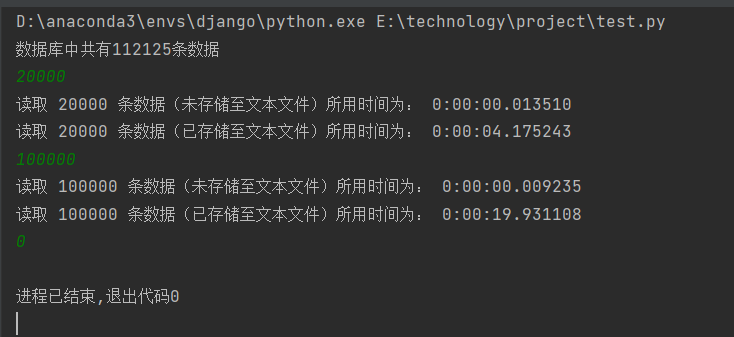
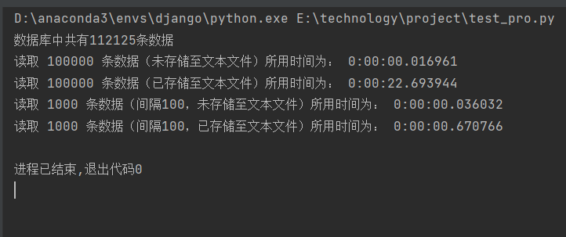

# 性能测试报告

[参考代码链接](https://github.com/xiao21wei/technology)

## 数据获取

### 主要内容：

调用接口，获取监测数据，将检测数据存储至文本文件

### 操作步骤：

**获取接口节点信息**：

调用 `http://IP:PORT/node/info`， 获取节点信息

```python
def get_nodeId():
    url = "http://" + IP + ":" + PORT + "/node/info"
    response = requests.get(url)
    nodeId_data = response.json()["data"]
    return nodeId_data
```

**根据nodeId获取设备信息**：

调用 `http://IP:PORT/equipment/node/{nodeId}/info`，根据nodeId参数，获取设备信息

```python
def get_equipment(nodeId):
    url = "http://" + IP + ":" + PORT + "/equipment/node/" + nodeId + "/info"
    response = requests.get(url)
    equipmentUuid_data = response.json()["data"]
    return equipmentUuid_dat
```

**根据equipmentUuid获取测点信息**：

调用`http://10.0.0.36:8088/point/status/all`接口，根据equipmentUuid参数，获取测点信息

```python
def get_point(equipmentUuid):
    url = "http://" + IP + ":" + PORT + "/point/" + equipmentUuid + "/info"
    response = requests.get(url)
    point_data = response.json()["data"]
    return point_data
```

**根据pointUuid和pointId获取实时趋势波形频谱信息**：

调用`http://IP:PORT/trend/{equipmentUuid}/{pointIdString}/real_time`接口，根据pointUuid和pointId参数，获取到实时趋势波形频谱信息

```python
def get_data(equipmentUuid, pointId):
    url = "http://" + IP + ":" + PORT + "/trend/" + equipmentUuid + "/" + pointId + "/real_time"
    response = requests.get(url)
    if 'data' in response.json():
        data_data = response.json()["data"]
        return data_data
    else:
        return None
```

**完整代码**：依次调用以上的函数，遍历读取有观测数据的测点的波形信息，并将波形信息存入文本文件中用于后续的数据写入,考虑到文件名格式问题，所以我们需要对时间信息进行格式化转换，即`t = time.strftime("%Y-%m-%d_%H_%M_%S", time.localtime(trendTime / 1000))`

```python
def get_real_time():
    nodeId_data = get_nodeId()
    for (i, nodeId) in enumerate(nodeId_data):
        equipmentUuid_data = get_equipment(nodeId["nodeId"])
        for (j, equipmentUuid) in enumerate(equipmentUuid_data):
            point_data = get_point(equipmentUuid["equipmentUuid"])
            for (k, point) in enumerate(point_data):
                data = get_data(equipmentUuid["equipmentUuid"], point["pointId"])
                if data is not None:
                    trendTime = data["trendTime"]
                    t = time.strftime("%Y-%m-%d_%H_%M_%S", time.localtime(trendTime / 1000))
                    equipmentName = data["equipmentName"]
                    name = equipmentName + "%%" + point["pointId"] + "%%" + t
                    f = open(name + ".txt", "w")
                    trendValue = json.dumps(data["trendValue"], ensure_ascii=False)
                    f.write(trendValue)
                    waveValue = json.dumps(data["waveValue"], ensure_ascii=False)
                    f.write(waveValue)
                    f.close()
```

## 数据写入

### 主要内容：

将数据获取部分得到的文本文件中的数据写入到`GBase 8s`数据库中

### 操作步骤：

**连接数据库，并创建对应的用户表**：

该部分使用GBaseDataStudio实现数据库的可视化操作，具体连接过程参考GBaseDataStudio管理工具手册完成

```sql
CREATE TABLE gbasedb.current_info (
	id SERIAL NOT NULL,
	equipmentname VARCHAR(100),
	pointid VARCHAR(100),
	trendtime DATETIME YEAR TO SECOND,
	currentvalue CLOB,
	PRIMARY KEY (id) CONSTRAINT current_info_pk
)
 in datadbs1 ;

CREATE INDEX current_info_equipmentname_idx ON gbasedb.current_info (equipmentname,pointid) ;
```

在该用户表的创建过程中，主要考虑到需要存储的数据的特征。对于equipmentname和pointid，可直接使用可变长字符型进行存储；对于trendtime，通过查看上一步中的数据的输出结果可知，时间存储格式为年到秒，所以需要使用`DATETIME YEAR TO SECOND`进行存储；对于currentvalue，查看上一步中存储的文本文件可知，即使是使用text数据类型，依旧无法实现存储功能，转而使用智能大对象`CLOB`进行存储，考虑到查询需求，我们创建equipmentname和pointid的索引，以便进行后续的查询工作。

**使用python配置数据库连接**：

考虑到并未直接提供可用于python配置`GBase 8s`数据库的连接工具，只提供了用于java和C语言连接数据库的工具，所以，我们考虑在python环境下配置Java虚拟机，并使用JDBC来实现相关的数据库操作。

```python
# jvm成功启动后导入相应的Java模块
jvmPath = r'C:\Program Files\Java\jdk-16.0.2\bin\server\jvm.dll'
jdbc_driver = r"E:\technology\project\gbasedbtjdbc_3.3.0_2P20220402_428c64.jar"
jpype.addClassPath(jdbc_driver)
if not jpype.isJVMStarted():
    jpype.startJVM(jvmPath)

from java.lang import *
from java.util import *
from java.sql import *


def connect_database():
    # 1.加载驱动
    url = "jdbc:gbasedbt-sqli://192.168.119.209:9088/gbasedb:GBASEDBTSERVER=gbaseserver;DB_LOCALE=zh_CN.utf8;CLIENT_LOCALE=zh_CN.utf8;NEWCODESET=UTF8,utf8,57372;GL_USEGLU=1"
    user = "gbasedbt"
    password = "ndtyGBase8s"
    driver_cls = JClass("com.gbasedbt.jdbc.Driver")
    # 获取驱动版本
    driver_version = driver_cls.getJDBCVersion()
    try:
        import java.lang.System as System
        conn = DriverManager.getConnection(url, user, password)
    except JException as e:
        print("连接失败")
        print(e.message())
        sys.exit(1)
    return conn
```

**将数据存入数据库：**

需要注意的是，python中的字符串存在长度上限，直接使用插入语句来实现数据的插入操作，所以，我们考虑直接从文件中读取数据，并转换成CLOB格式，并存入到用户表的对应字段，同时，需要对时间的格式进行转换，防止在数据插入时出现预料之外的错误。

```python
def store_data(equipmentName, pointId, data_time, data):  # 将数据导入到数据库中
    conn = connect_database()
    # 2.创建Statement对象
    stmt = conn.createStatement()
    data_time = datetime.datetime.strptime(data_time, "%Y-%m-%d_%H_%M_%S")
    data_time = data_time.strftime("%Y-%m-%d %H:%M:%S")
    # 3.执行SQL语句
    sql = "insert into current_info(id, equipmentname, pointid, trendtime, currentvalue) " \
        "values(0, '" + equipmentName + "','" + pointId + "','" + data_time + "',FILETOCLOB('" + data + "', 'client'))"
    stmt.execute(sql)
    # 4.关闭连接
    stmt.close()
    conn.close()
```

**删除已完成数据读入的文本文件：**

文本文件完成数据读取后，需要及时从文件夹中删除，防止对同一文本文件进行重复读入。需要注意的是，删除文件时需要先判断文件的权限，保证文件能够安全删除。

```python
def delete_file(file_name):
    # 删除该目录下,文件名为file_name的文件
    path = os.getcwd()
    for root, dirs, files in os.walk(path):
        for file in files:
            if os.path.splitext(file)[1] == '.txt':
                f = open(os.path.join(root, file), "r")
                # 获取文件的名称
                name = os.path.splitext(file)[0]
                f.close()
                if name == file_name:
                    if os.access(os.path.join(root, file), os.F_OK):
                        os.chmod(os.path.join(root, file), stat.S_IWRITE)
                    os.remove(os.path.join(root, file))
```

**从文本文件中完成数据写入操作：**

在数据写入时，我们需要将当前文件夹下，所有的文本文件进行解析，将文件名进行划分，得到需要存储的equipmentname，pointId，data_time数据，并调用store()，将数据存入数据库，再调用delete_file()，将完成诗句写入的文件删除，在数据写入的过程中，需要记录并返回，数据的数量，方便后续的数据库操作。

```python
def read_data():  # 从该目录下的txt文件中读取数据，存入数据库
    num = 0
    path = os.getcwd()
    for root, dirs, files in os.walk(path):
        for file in files:
            if os.path.splitext(file)[1] == '.txt':
                num = num + 1
                f = open(os.path.join(root, file), "r")
                # 获取文件的名称
                file_name = os.path.splitext(file)[0]
                name = file_name.split("%%")
                equipmentName = name[0]
                pointId = name[1]
                data_time = name[2]
                f.close()
                store_data(equipmentName, pointId, data_time, file_name+'.txt')
                delete_file(file_name)
    return num
```

## 性能测试

### 主要内容：

针对数据库中存储的数据，测试读取不同数据量所用时间的差异，对性能进行评估。

### 操作步骤：

**获取数据信息：**

首先，我们需要获取到存储的数据的一些相关信息，比如，当前数据库中存储的数据量。对于性能测试而言，当前数据库中存储的数据量，会对性能产生较大影响，所以我们需要获取到当前数据库中的数据量。

```python
def count_data():
    ans = 0
    conn = connect_database()
    # 2.创建Statement对象
    stmt = conn.createStatement()
    # 3.执行SQL语句
    sql = "select count(*) from current_info"
    rs = stmt.executeQuery(sql)
    # 4.处理结果集
    while rs.next():
        ans = rs.getString(1)
    # 5.关闭结果集
    rs.close()
    # 6.关闭连接
    stmt.close()
    conn.close()
    return ans
```

**数据读取性能获取：**

在测试性能时，我们需要关注读取的数据的数量和所用时间进行检测，并输出查询出指定条数据所用的时间。对于读取出的数据，我们根据查询的数据条数和查询时间为文件名，创建文本文件，存储查询到的结果。

```python
def select_data(num):  # 返回从数据库中读取到num条数据，导入到文件中，并记录读取到的数据所用的时间
    conn = connect_database()
    time1 = datetime.datetime.now()
    # 2.创建Statement对象
    stmt = conn.createStatement()
    # 3.执行SQL语句
    sql = "select * from current_info where id <= " + str(num)
    rs = stmt.executeQuery(sql)
    time2 = datetime.datetime.now()
    # 4.处理结果集，将结果导入到txt文件中
    file_name = str(num) + "_" + str(time1.strftime("%Y-%m-%d_%H_%M_%S")) + ".txt"
    with open(file_name, "w") as f:
        while rs.next():
            id = str(rs.getString(1))
            equipmentname = str(rs.getString(2))
            pointid = str(rs.getString(3))
            trendtime = str(rs.getString(4))
            f.write(id + "," + equipmentname + "," + pointid + "," + trendtime  + "\n")
    time3 = datetime.datetime.now()
    # 5.关闭结果集
    rs.close()
    # 6.关闭连接
    stmt.close()
    conn.close()
    return time2 - time1, time3-time1
```

**性能测试输出：**

调用count_data()，获取数据量，从命令行输入读取数据的数量t1，把读取数据的数量作为参数，调用select_data(t1)，得到读取t1条数据所用的时间。

```python
def select():
    count = count_data()
    print("数据库中共有" + str(count) + "条数据")
    while True:
        t1 = input()
        if t1 == '0':
            break
        else:
            time1, time2 = select_data(t1)
            print("读取", t1, "条数据（未存储至文本文件）所用时间为：", time1)
            print("读取", t1, "条数据（已存储至文本文件）所用时间为：", time2)
```

**数据读取性能获取（新增）：**

我们尝试在数据获取过程中，对读取到的数据新增间隔设置，要求查询出来的结果在数据库中具有固定的间隔，以此来分析查询算法的性能对数据读取的影响。

在SQL查询语句中，我们新增对id的限定，要求获取到的数据的id能够被length参数整除。

```python
def select_data_pro(num, length):
    conn = connect_database()
    # 2.创建Statement对象
    stmt = conn.createStatement()
    time1 = datetime.datetime.now()
    # 3.执行SQL语句
    sql = "select * from current_info where id <= " + str(num) + "and MOD(id, " + str(length) + ") = 0"
    rs = stmt.executeQuery(sql)
    time2 = datetime.datetime.now()
    # 4.处理结果集，将结果导入到txt文件中
    file_name = str(num) + "_" + str(length) + "_" + str(time1.strftime("%Y-%m-%d_%H_%M_%S")) + ".txt"
    with open(file_name, "w") as f:
        while rs.next():
            id = str(rs.getString(1))
            equipmentname = str(rs.getString(2))
            pointid = str(rs.getString(3))
            trendtime = str(rs.getString(4))
            f.write(id + "," + equipmentname + "," + pointid + "," + trendtime + "\n")
    time3 = datetime.datetime.now()
    # 5.关闭结果集
    rs.close()
    # 6.关闭连接
    stmt.close()
    conn.close()
    return time2 - time1, time3 - time1
```

**性能测试输出（新增）：**

我们需要测试直接读取100000条数据所用时间和从100000条数据中，以100为间隔读取1000条数据所用时间进行输出分析。

```python
def select_pro():
    count = count_data()
    print("数据库中共有" + str(count) + "条数据")
    time1, time1_1 = select_data(100000)
    time2, time2_1 = select_data_pro(100000, 100)
    time3, time3_1 = select_data(1000)
    print("读取", 100000, "条数据（未存储至文本文件）所用时间为：", time1)
    print("读取", 100000, "条数据（已存储至文本文件）所用时间为：", time1_1)
    print("读取", 1000, "条数据（间隔100，未存储至文本文件）所用时间为：", time2)
    print("读取", 1000, "条数据（间隔100，已存储至文本文件）所用时间为：", time2_1)
```

## 性能测试分析

### 第一轮测试：

在第一轮测试中，我们需要比较读取20000条数据和100000条数据所用的时间。运行结果如下：



如果只考虑数据的读取时间，可以发现，读取20000条数据和读取100000条数据均能在较短时间内完成，并且读取时间差异不大。

但是，如果我们将数据的解析过程加入（即将数据写入文件），可以发现，此时读取100000条数据所用时间要明显多于读取20000条数据所用的时间。

综上，在相同的查询条件下，数据的读取时间相差不大，但是，当我们需要对数据进行一定程度的处理时，读取的数据量会极大地影响到读取的性能。

### 第二轮测试：

在第二轮测试中，我们需要比较读取100000条数据（无间隔）和读取1000条数据（间隔为100）所用时间。运行结果如下：



如果只考虑数据的读取时间，可以发现，两种情况的查询时间具有较大差异。这种差异主要是由数据查询条件引起的。两种情况均会遍历数据库中的前100000条数据，但是，第一种情况（无间隔）只需要判断id的范围，而第二种情况（100间隔）在查询过程中需要判断id范围，以及id能否被100整除，并且在每访问到一组数据时，都需要对id进行一定程度的计算，所以第二种情况的查询时间明显增加。

但是，如果我们将数据的解析过程加入（即将数据写入文件），可以发现，数据存储所用时间明显大于数据读取所用时间。此时，数据读取的时间主要受到数据量的影响，所以，读取100000条数据（无间隔）所用时间明显多于读取1000条数据（间隔为100）所用时间。

综上，数据读取效率会受到数据的查询条件的影响，即使是在访问相同数据量的情况下，新增查询条件依旧会导致数据查询时间增加。由此，我们在进行数据查询操作时需要根据查询条件，优化查询语句，以此来达到更高的查询效率。
