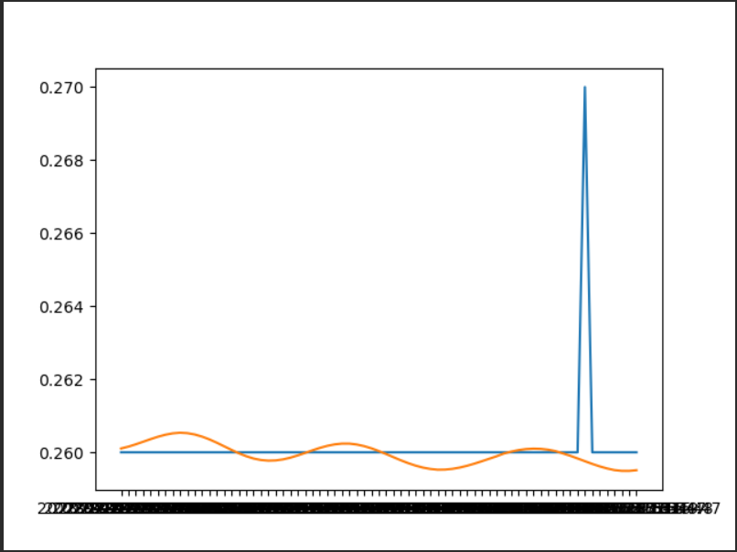
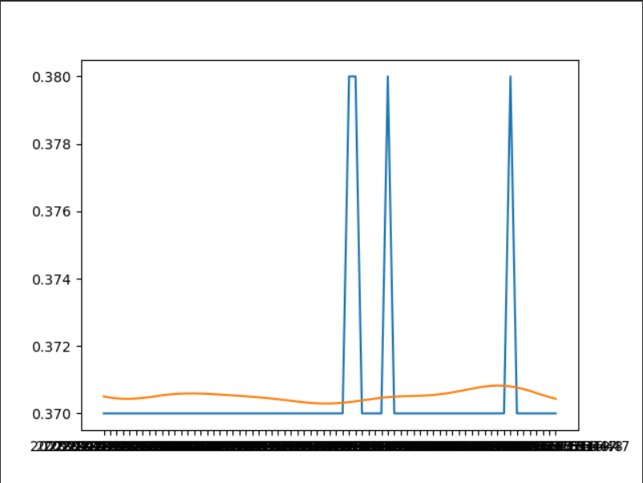
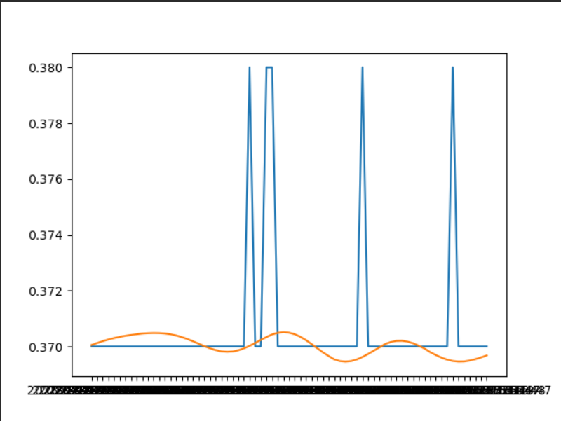
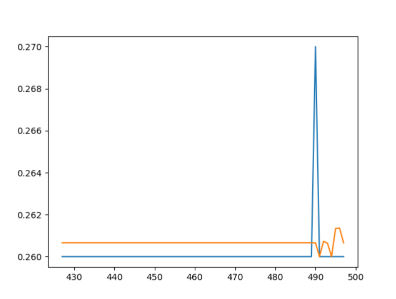
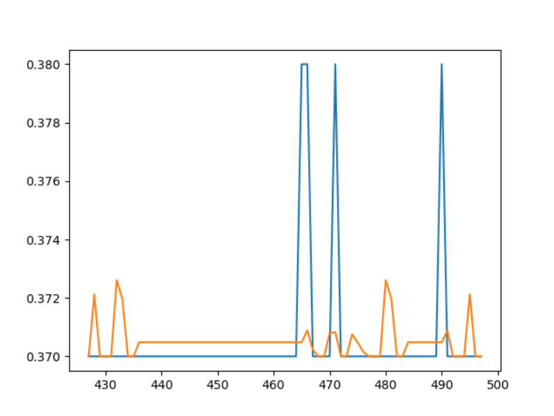
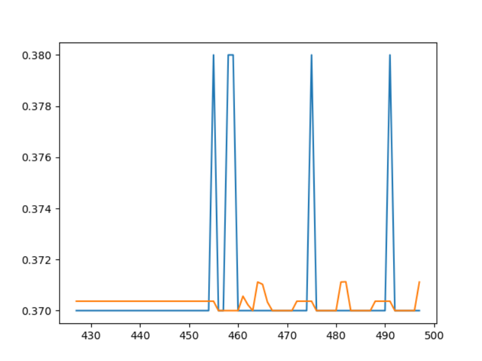
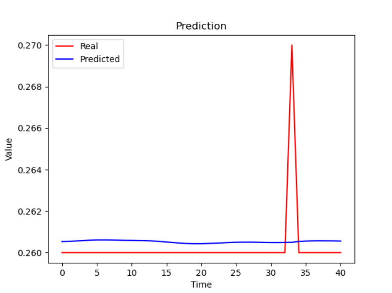
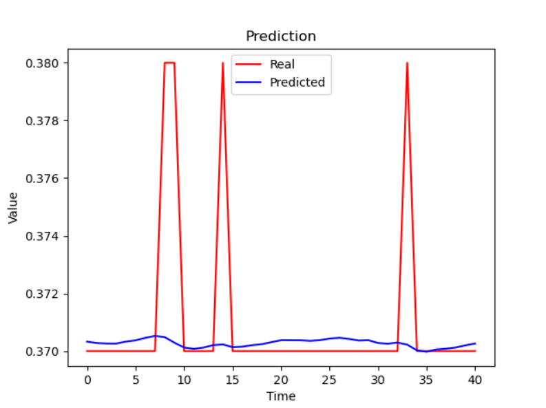
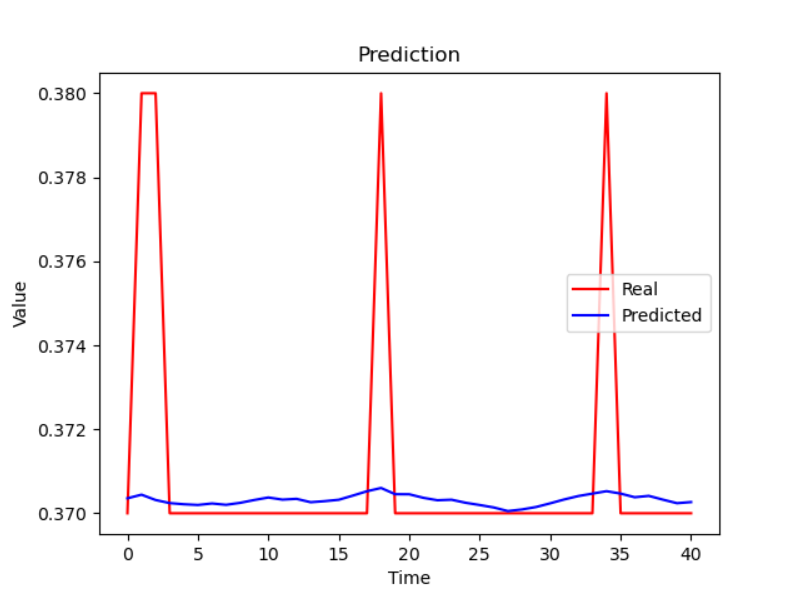

# 趋势预测报告

[参考代码链接](https://github.com/xiao21wei/technology)

## 任务内容

从接口取到的数据，取上一段时间数据（最少1周的），然后用预测算法预测一下趋势。

1. 预测的数据和实际数据进行比对 
2. 预测的数据在多长时间段内是较优解 
3. 预测算法三类都比较下（统计学模型、机器学习、循环神经网络）

## 预测算法分析

该情景是一个非常典型的时序预测问题。时间序列预测，其主要任务是基于某一指标的历史数据来预测其在未来的取值。我们需要使用一段时间的历史数据来预测接下来一段时间的数据变化趋势。此时我们需要使用到一些常用的预测算法（统计学模型、机器学习、循环神经网络），接下来是关于不同预测算法的一些分析。

### 统计学模型

统计学模型是一种非常典型的预测算法。在本次预测中，我们选择的是Facebook开发的Prophet模型。该模型本质上是在统计学模型的趋势变化和周期性的特点上，综合考虑季节性，节假日，时间拐点等因素的影响，从而进行更加精准的时序规律刻画。在本次的趋势预测中，由于使用的历史数据的时间跨度为一周，并不能体现出Prophet模型的优势，但是，在一定程度上也能较好的反映出数据变化的趋势。

### 机器学习

机器学习模型进行时序预测时，一般是把时序问题转换成监督学习，通过特征方程和机器学习方法建立回归模型，并用模型进行预测。在本次预测中我们选择的是RandomForest回归模型。该模型通过对训练集中进行随机分类，在预测数据时，每个分类发模型都会给出一个预测值，根据简单多数的原则，选择出最终的预测结果。由于该情景有较强的时序性，该模型的实际效果一般。

### 循环神经网络

循环神经网络对于有较强序列特性的数据预测的效果较好。循环神经网络的实质是，将上一步的结果作为本次的输入和当前输入一起起作用，用于当前数据的预测。在本次预测中，我们选择的是LSTM模型。该模型是一种特殊的RNN，主要是为了解决长序列训练过程中的梯度消失和梯度爆炸问题。在预测数据时，该模型会将前一段时间的数据和当前数据一同作为输入，最终达到数据变化趋势。

## 代码内容分析

### 数据获取

我们通过向后端的历史数据查询接口发送请求，将得到的数据存入到csv文件中，用于接下来的数据趋势预测。需要注意的是，数据库中存储的是UNIX毫米时间戳，通过查看获取到的数据可以发现获取到的历史数据之间有一定的间隔，所以在存储时间的时候，可以直接将时间数据转换成`%Y-%m-%d %H:%M:%S`的格式。同时，不同的测点之间可能存在一定的差异，所以，我们可以直接将`pointId`作为文件名。此外，在历史数据的获取时，我们选择8天的时间跨度，并将前七天的数据作为训练数据，将最后一天的数据作为测试数据。

```python
def get_history(equipmentUuid, pointId, startTime, endTime):
    url = "http://" + IP + ":" + PORT + "/trend/" + equipmentUuid + "/" + pointId + "/" + startTime + "/" + endTime + "/info"
    response = requests.get(url)
    if 'data' in response.json():
        data_data = response.json()["data"]
        return data_data
    else:
        return None


def load_data(start, end):
    points = get_point("b1161555a5cf4cb0f060a7442127b7b6")
    for point in points:
        data = get_history("b1161555a5cf4cb0f060a7442127b7b6", point["pointId"], start, end)
        if data is not None and len(data["trendInfo"]) != 0:
            trendInfo = data["trendInfo"]
            f = open(point["pointId"] + ".csv", "w", encoding="utf-8", newline="")
            csv_writer = csv.writer(f)
            csv_writer.writerow(["trendTime", "all", "one", "two", "three", "half", "res"])
            for trend in trendInfo:
                trendTime = trend["trendTime"]
                t = time.strftime("%Y-%m-%d %H:%M:%S", time.localtime(trendTime / 1000))
                all = trend["trendValue"][0]["all"]
                one = trend["trendValue"][0]["one"]
                two = trend["trendValue"][0]["two"]
                three = trend["trendValue"][0]["three"]
                half = trend["trendValue"][0]["half"]
                res = trend["trendValue"][0]["res"]
                csv_writer.writerow([t, all, one, two, three, half, res])
            f.close()


if __name__ == '__main__':
    # 获取当前时间的UNIX毫秒时间戳和一周前的UNIX毫秒时间戳
    now = int(time.time() * 1000)
    end = now
    start = end - 8 * 24 * 60 * 60 * 1000
    # 将UNIX毫秒时间戳转换为字符串
    end = str(end)
    start = str(start)
    print(start)
    print(end)
    load_data(start, end)
```

### 统计学模型

```python
def prophet_model_train(df):
    # Create the Prophet model
    model = Prophet()
    # Fit the model to the data
    model.fit(df)
    return model
```

```python
def prophet_model_predict(model, future):
    # Make predictions
    forecast = model.predict(future)
    return forecast
```

以上是用于模型训练和模型预测是函数。

```python
def prophet_model_test(csv_file, value):
    # Load the data
    df = pd.read_csv(csv_file)
    # Rename the columns
    df = df.rename(columns={'trendTime': 'ds', value: 'y'})
    last_data_time = df['ds'].iloc[-1]
    print(last_data_time)
    # last_data_time为%Y-%m-%d %H:%M:%S格式,计算一天前的时间
    last_data_time = pd.to_datetime(last_data_time) - pd.Timedelta(days=1)
    last_data_time = last_data_time.strftime('%Y-%m-%d %H:%M:%S')
    print(last_data_time)
    # 划分训练集和测试集
    train_df = df[df['ds'] < last_data_time]
    test_df = df[df['ds'] >= last_data_time]
    # Create the Prophet model
    model = prophet_model_train(train_df)
    # Create the future dataframe
    future = test_df[['ds']]
    # Make predictions
    forecast = prophet_model_predict(model, future)
    # Plot the predictions
    plt.plot(train_df['ds'], train_df['y'])
    plt.plot(test_df['ds'], test_df['y'])
    plt.plot(future['ds'], forecast['yhat'])
    plt.show()
```

模型构建好后，我们对最后一天的数据进行预测，并绘制出相应的趋势图。

### 机器学习

```python
def randomForest_model_train(x, y):
    # Create the random forest model
    model = RandomForestRegressor()
    # Fit the model to the data
    model.fit(x, y)
    return model
```

```python
def randomForest_model_predict(model, future):
    # Make predictions
    forecast = model.predict(future)
    return forecast
```

模型的训练和预测过程和前一个模型类似。

```python
def randomForest_model_test(csv_file, value):
    # Load the data
    df = pd.read_csv(csv_file)
    # Rename the columns
    df = df.rename(columns={'trendTime': 'ds', value: 'y'})
    last_data_time = df['ds'].iloc[-1]
    print(last_data_time)
    # last_data_time为%Y-%m-%d %H:%M:%S格式,计算一天前的时间
    last_data_time = pd.to_datetime(last_data_time) - pd.Timedelta(days=1)
    last_data_time = last_data_time.strftime('%Y-%m-%d %H:%M:%S')
    print(last_data_time)
    # 划分训练集和测试集
    data = df.copy()
    n = 12
    for i in range(1, n+1):
        data['ypre_' + str(i)] = data['y'].shift(i)
    data = data[['ds'] + ['ypre_' + str(i) for i in range(n, 0, -1)] + ['y']]  # 选择特征

    x_train = data[data['ds'] < last_data_time].dropna()[['ypre_' + str(i) for i in range(n, 0, -1)]]
    y_train = data[data['ds'] < last_data_time].dropna()['y']
    x_test = data[data['ds'] >= last_data_time].dropna()[['ypre_' + str(i) for i in range(n, 0, -1)]]
    y_test = data[data['ds'] >= last_data_time].dropna()['y']

    # Create the random forest model
    model = randomForest_model_train(x_train, y_train)
    # Make predictions
    forecast = randomForest_model_predict(model, x_test)
    # Plot the predictions
    plt.plot(x_train.index, y_train)
    plt.plot(x_test.index, y_test)
    plt.plot(x_test.index, forecast)
    plt.show()
```

该模型的重点是通过滑动窗口的方式来提取特征和标签，然后滑动截取测试机特征来实现单步预测。

### 循环神经网络

```python
def lstm_model_test(csv_file, value):
    # Load the data
    custom_date_parser = lambda x: datetime.strptime(x, "%Y-%m-%d %H:%M:%S")
    df = pd.read_csv(csv_file, parse_dates=['trendTime'], date_parser=custom_date_parser, index_col='trendTime')
    # Rename the columns
    last_data_time = df.index[-1]
    print(last_data_time)
    # last_data_time为%Y-%m-%d %H:%M:%S格式,计算一天前的时间
    last_data_time = last_data_time - pd.Timedelta(days=1)
    print(last_data_time)
    # 划分训练集和测试集
    train_df = df[df.index < last_data_time]
    test_df = df[df.index >= last_data_time]

    # 归一化
    scaler = MinMaxScaler(feature_range=(0, 1))
    df_for_training_scaled = scaler.fit_transform(train_df)
    df_for_testing_scaled = scaler.fit_transform(test_df)

    # 划分训练集和测试集
    trainX, trainY = createXY(df_for_training_scaled, 30)
    testX, testY = createXY(df_for_testing_scaled, 30)

    grid_model = KerasRegressor(build_fn=build_model, verbose=1, validation_data=(testX, testY))
    parameters = {'batch_size': [16, 20], 'epochs': [8, 10], 'optimizer': ['adam', 'Adadelta']}

    grid = GridSearchCV(estimator=grid_model, param_grid=parameters, cv=2)

    grid_search = grid.fit(trainX, trainY)

    grid_search.best_params_ = {'batch_size': 16, 'epochs': 10, 'optimizer': 'adam'}
    my_model = grid_search.best_estimator_.model

    prediction = my_model.predict(testX)
    prediction_copies_array = np.repeat(prediction, 6, axis=-1)
    pred = scaler.inverse_transform(np.reshape(prediction_copies_array, (len(prediction), 6)))[:, 0]
    original_copies_array = np.repeat(testY, 6, axis=-1)
    original = scaler.inverse_transform(np.reshape(original_copies_array, (len(testY), 6)))[:, 0]

    plt.plot(original, color='red', label='Real')
    plt.plot(pred, color='blue', label='Predicted')
    plt.title('Prediction')
    plt.xlabel('Time')
    plt.ylabel('Value')
    plt.legend()
    plt.show()


def createXY(dataset, n_past):
    dataX = []
    dataY = []
    for i in range(n_past, len(dataset)):
        dataX.append(dataset[i - n_past:i, 0:dataset.shape[1]])
        dataY.append(dataset[i, 0])
    return np.array(dataX), np.array(dataY)


def build_model(optimizer):
    grid_model = Sequential()
    grid_model.add(LSTM(50, return_sequences=True, input_shape=(30, 6)))
    grid_model.add(LSTM(50))
    grid_model.add(Dropout(0.2))
    grid_model.add(Dense(1))
    grid_model.compile(loss='mean_squared_error', optimizer=optimizer)
    return grid_model
```

在循环神经网络的时序预测中，可以使用多个变量进行数据预测，所以，我们在训练数据时，将数据获取时取得的训练数据的所有字段一同作为输入，用于数据的趋势预测。

## 预测结果分析

### 统计学模型

`30cs`测点的`all`字段：



`35cd`测点的`all`字段：



`40cs`测点的`all`字段：



通过预测结果可以发现，统计学模型只能预测到大部分数据的变化范围，考虑到训练数据仅保留至小数点后两位，所以该一侧结果较为准确。

### 机器学习

`30cs`测点的`all`字段：



`35cd`测点的`all`字段：



`40cs`测点的`all`字段：



通过预测结果可以看出，此时的预测结果已经逐渐能够看出数据的变化趋势，但是在数据发生突变时，该模型仅能体现出趋势变化，而不能达到真实值的范围。

### 循环神经网络

`30cs`测点的`all`字段：



`35cd`测点的`all`字段：



`40cs`测点的`all`字段：



通过预测结果可以看出，该模型得到的趋势预测结果在数据发生变化时有了较为明显的波动，表明在一定程度上，该模型得到的预测趋势能够和实际的变化趋势重合。但是，考虑到使用的历史数据较少，并不能准确预测到数据。在后续预测过程中需要增加用于训练的历史数据，由此来提高该模型趋势预测的准确性。

## 算法对比分析

通过观察历史数据可以发现，测点的`all`字段在最近一周的时间内并未出现较大波动，且数据发生波动的规律性不强，很多时间点数据发生变化也基本看不出规律。

使用统计学模型进行预测时，由于数据量较小，难以分析出规律性，导致最终的趋势预测效果不佳；

使用机器学习模型时，能够发现，在原本的基础上，得到的预测趋势会在某些时刻发生变化，这种变化，正式该模型的优势体现，该模型能够根据之前的数据，预测接下来可能出现的趋势变化，但是用于训练的数据量较小，该模型只能预测到可能会有波动，但是对波动的时刻，和波动的幅度都无法准确预测；

使用循环神经网络模型时，能够发现，得到的预测趋势走向已经能够和真实的数据基本吻合，在大多数情况下，能够准确预测到数据的趋势变化，准确度较高，但是有由于数据量和数据的值的限定，得到的模型还有较大的提升空间，在后续的预测过程中，可以尝试使用更长时间跨度的历史数据来训练模型。

## 总结

以上三种模型使用一周的数据来训练模型，并将模型用于接下来一天的数据趋势变化预测，最终得到了接下来一天的趋势变化，通过分析得到的数据可以发现，随时间的延长，预测的效果逐渐变差，这是因为可供模型用于预测的准确的真实值越来越少，模型只能将预测得到的数据用于接下来的预测，这就导致，当某一次的预测出现较大偏差时，会导致接下来的预测数据出现一定程度的偏差。想要减少这种偏差带来的影响，只能增大用于训练模型的数据量。用巨大的数据量来优化模型，让模型能够在每一次的预测中都能有较好的预测效果，由此减小由预测偏差导致的后续预测结果偏差影响。