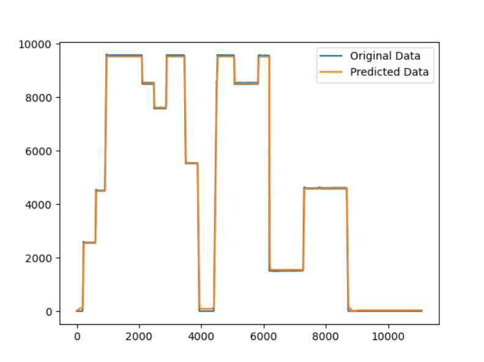
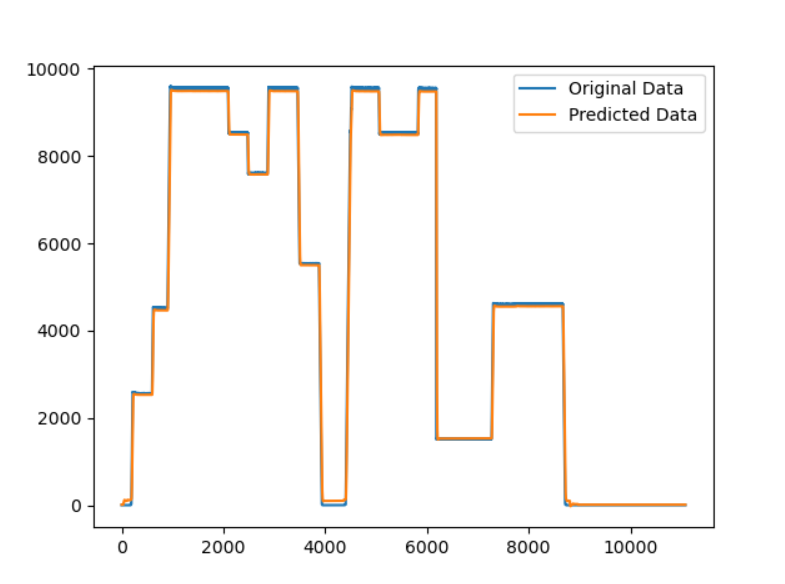
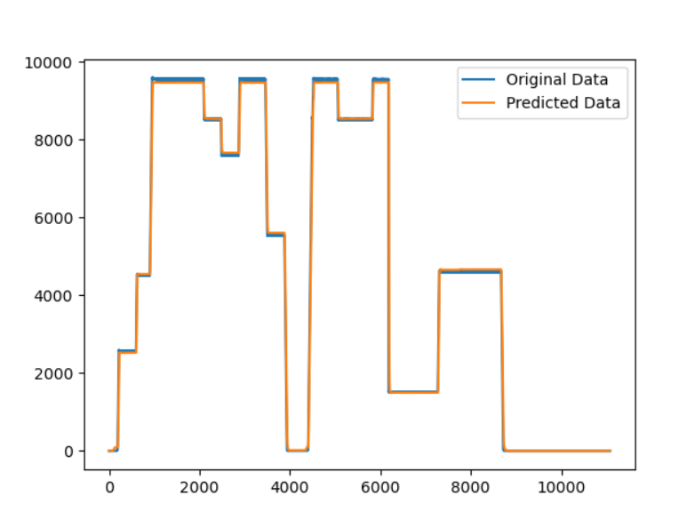
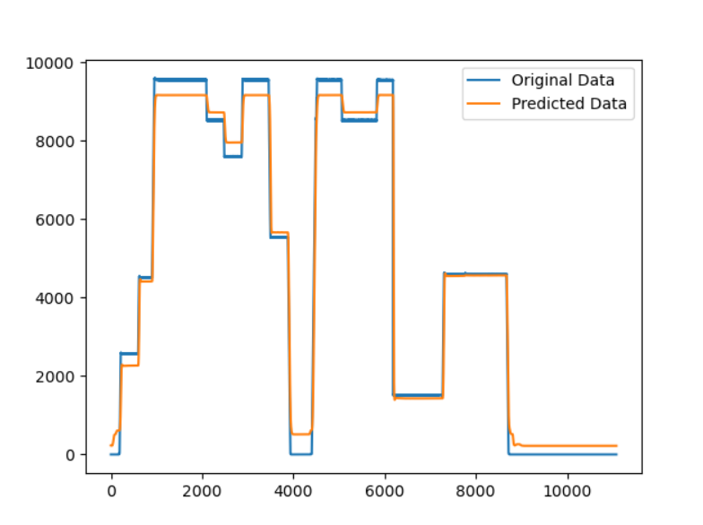
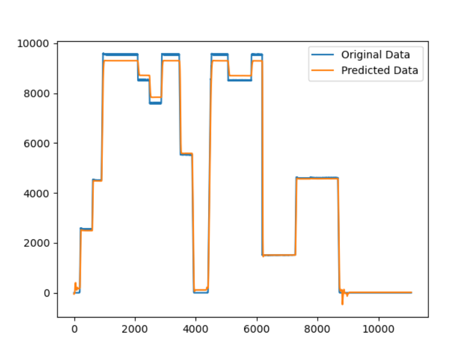
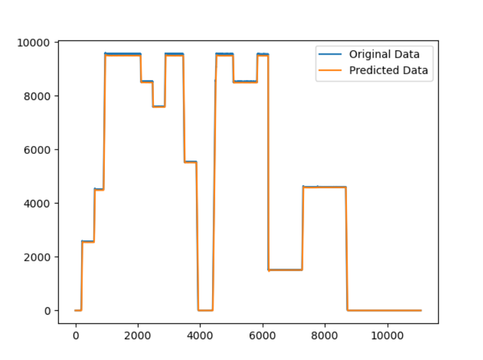

# 趋势预测报告（LSTM模型优化）

[参考代码链接](***https://github.com/xiao21wei/technology***)

在之前的参数优化过后，我们得到了如下效果较好的参数组合：

```python
{'batch_size': 128, 'epochs': 40, 'optimizer': 'SGD'}

{'batch_size': 128, 'epochs': 50, 'optimizer': 'SGD'}
```

这两组参数得到的结果分别为





观察得到的趋势预测结果可知，该模型目前在总体上的表现较好，但是在真实值为0时，预测结果出现部分的负值，虽然这部分负值的数量较少，且数值较小，但考虑到模型预测结果的准确度，我们接下来希望从原始数据的预处理和模型的训练过程入手，消除出现的预测值为负值的情况。

```python
    scaler = MinMaxScaler(feature_range=(0, 1))
    df_for_training_scaled = scaler.fit_transform(df_for_training)
    df_for_testing_scaled = scaler.transform(df_for_testing)

    trainX, trainY = createXY(df_for_training_scaled, 50)
    testX, testY = createXY(df_for_testing_scaled, 50)

    # trainX, trainY = createXY(df_for_training.values, 30)
    # testX, testY = createXY(df_for_testing.values, 30)

    print("trainX Shape-- ", trainX.shape)
    print("trainY Shape-- ", trainY.shape)

    print("testX Shape-- ", testX.shape)
    print("testY Shape-- ", testY.shape)

    # 遍历trainX,trainY,testX,testY,输出其中的负值
    for i in range(len(trainX)):
        for j in range(len(trainX[i])):
            if trainX[i][j][0] < 0:
                print("trainX[", i, "][", j, "][0]=", trainX[i][j][0])
            if trainX[i][j][1] < 0:
                print("trainX[", i, "][", j, "][1]=", trainX[i][j][1])
        if trainY[i] < 0:
            print("trainY[", i, "]=", trainY[i])

    for i in range(len(testX)):
        for j in range(len(testX[i])):
            if testX[i][j][0] < 0:
                print("testX[", i, "][", j, "][0]=", testX[i][j][0])
            if testX[i][j][1] < 0:
                print("testX[", i, "][", j, "][1]=", testX[i][j][1])
        if testY[i] < 0:
            print("testY[", i, "]=", testY[i])
            
def createXY(dataset, n_past):
    dataX = []
    dataY = []
    for i in range(n_past, len(dataset)):
        # dataX为前n_past天的Ng数据
        # dataY为第n_past天的GenPCal数据
        dataX.append(dataset[i - n_past:i, 0:dataset.shape[1]])
        dataY.append(dataset[i, 1])
    return np.array(dataX), np.array(dataY)
```

使用上述代码进行数据预处理时，并没有输出任何负值数据，说明在原始数据的预处理前后并没有出现任何负值，所以，通过数据预处理部分的修改解决负值问题的可能性不大。接下来我们重点关注模型的训练过程，通过修改训练过程中的参数来尝试解决负值问题。

考虑到参数优化的时间成本，我们选用的参数组合为：

```python
parameters = {
	'batch_size': 128,  # 批处理大小
	'epochs': 40,  # 迭代次数
	'optimizer': 'SGD'  # 优化器
}
```

未添加激活函数时：

```python
def build_model(optimizer):  # 构建模型，optimizer为优化器
    grid_model = Sequential()
    grid_model.add(LSTM(50, return_sequences=True, input_shape=(50, 2)))
    grid_model.add(LSTM(50))  # return_sequences默认为False
    grid_model.add(Dropout(0.2))  # 防止过拟合
    grid_model.add(Dense(1))  # 全连接层

    grid_model.compile(loss='mse', optimizer=optimizer)  # 编译模型
    return grid_model
```


预测结果较为理想，但是在预测结果的部分数据点中出现不合理的负值。

我们使用`relu`作为全连接层的激活函数来训练模型：

```python
def build_model(optimizer):  # 构建模型，optimizer为优化器
    grid_model = Sequential()
    grid_model.add(LSTM(50, return_sequences=True, input_shape=(50, 2)))
    grid_model.add(LSTM(50))  # return_sequences默认为False
    grid_model.add(Dropout(0.2))  # 防止过拟合
    grid_model.add(Dense(1, activation='relu'))  # 全连接层

    grid_model.compile(loss='mse', optimizer=optimizer)  # 编译模型
    return grid_model
```


此时，预测结果均未出现负值，说明，使用`relu`作为激活函数时，可以保证预测结果不出现负值。

我们尝试在构建的LSTM模型的前两层中也添加激活函数：

```python
def build_model(optimizer):  # 构建模型，optimizer为优化器
    grid_model = Sequential()
    grid_model.add(LSTM(50, return_sequences=True, input_shape=(50, 2), activation='relu'))
    grid_model.add(LSTM(50, activation='relu'))  # return_sequences默认为False
    grid_model.add(Dropout(0.2))  # 防止过拟合
    grid_model.add(Dense(1, activation='relu'))  # 全连接层

    grid_model.compile(loss='mse', optimizer=optimizer)  # 编译模型
    return grid_model
```



可以发现，我们在LSTM模型的前两层中添加激活函数后，模型的预测效果并没有显著提升，但是考虑到模型训练的时间成本，我们在后续的测试中将舍弃LSTM模型的前两层中的激活函数。

接下来我们尝试使用`sigmoid`激活函数：

```python
def build_model(optimizer):  # 构建模型，optimizer为优化器
    grid_model = Sequential()
    grid_model.add(LSTM(50, return_sequences=True, input_shape=(50, 2)))
    grid_model.add(LSTM(50))  # return_sequences默认为False
    grid_model.add(Dropout(0.2))  # 防止过拟合
    grid_model.add(Dense(1, activation='sigmoid'))  # 全连接层

    grid_model.compile(loss='mse', optimizer=optimizer)  # 编译模型
    return grid_model
```



观察预测结果可以发现，使用`sigmoid`作为激活函数时，得到的预测结果很差，在很多数据点上都与真实值存在较大差距。

接下来我们尝试使用`linear`激活函数：

```python
def build_model(optimizer):  # 构建模型，optimizer为优化器
    grid_model = Sequential()
    grid_model.add(LSTM(50, return_sequences=True, input_shape=(50, 2)))
    grid_model.add(LSTM(50))  # return_sequences默认为False
    grid_model.add(Dropout(0.2))  # 防止过拟合
    grid_model.add(Dense(1, activation='linear'))  # 全连接层

    grid_model.compile(loss='mse', optimizer=optimizer)  # 编译模型
    return grid_model
```


观察得到的趋势预测结果可知，在`linear`激活函数的作用下，模型的预测结果较好，但是在部分时间点上预测结果得到的负值。

接下来我们尝试使用`tanh`激活函数：

```python
def build_model(optimizer):  # 构建模型，optimizer为优化器
    grid_model = Sequential()
    grid_model.add(LSTM(50, return_sequences=True, input_shape=(50, 2)))
    grid_model.add(LSTM(50))  # return_sequences默认为False
    grid_model.add(Dropout(0.2))  # 防止过拟合
    grid_model.add(Dense(1, activation='tanh'))  # 全连接层

    grid_model.compile(loss='mse', optimizer=optimizer)  # 编译模型
    return grid_model
```



预测结果显示，`tanh`激活函数在该场景下的表现较差。

以上四种激活函数的具体分析：

> 1. ReLU（Rectified Linear Unit）函数: 优点：
>
>    - 计算速度快，因为只有一个分段函数。
>    - 避免了梯度消失问题，对于较深的神经网络来说更加有效。
>    - 稀疏激活性：大部分神经元在训练过程中会变得不活跃，只有少数神经元被激活，从而提高了计算效率。
>
>    缺点：
>
>    - 针对负数输入，输出为零，可能导致"神经元死亡"问题，即在训练过程中部分神经元永远不会被激活。
>    - 不是严格限定在范围[-1, 1]内的输出。
>
>    适用场景：
>
>    - 隐藏层的默认激活函数之一。
>    - 对于大规模的深度神经网络，可以提高计算速度。
>
> 2. Sigmoid（Logistic）函数： 优点：
>
>    - 输出值范围在(0, 1)之间，可以看作是概率值。
>    - 平滑连续的输出，有助于梯度的计算。
>
>    缺点：
>
>    - 容易出现梯度消失问题，尤其是在深层网络中，导致训练缓慢。
>    - 输出不是以零为中心，对网络权重的更新造成限制。
>
>    适用场景：
>
>    - 二分类问题。
>    - 输出层需要将输出映射到概率值的情况。
>
> 3. Linear（恒等）函数： 优点：
>
>    - 简单直接，保留输入的线性关系。
>    - 输出与输入成正比，没有压缩。
>
>    缺点：
>
>    - 没有非线性特性，无法拟合复杂的非线性模式。
>
>    适用场景：
>
>    - 适用于回归问题或者输出层不需要经过非线性变换的情况。
>
> 4. tanh（双曲正切）函数： 优点：
>
>    - 输出值范围在[-1, 1]之间，相对于Sigmoid函数更好的对称性。
>
>    缺点：
>
>    - 仍然存在梯度消失的问题。
>    - 对于负值输入，梯度接近于零，在反向传播过程中会有较小的梯度。
>
>    适用场景：
>
>    - 隐藏层的默认激活函数之一。
>    - 对于输出介于[-1, 1]的情况，如生成对抗网络（GAN）中的判别器。

综合上述的预测结果，我们可以选择适用`relu`作为该模型的激活函数。

到目前为止，我们选择的用于构建LSTM模型的核心代码部分如下：

```python
def build_model(optimizer):  # 构建模型，optimizer为优化器
    grid_model = Sequential()
    grid_model.add(LSTM(50, return_sequences=True, input_shape=(50, 2)))
    grid_model.add(LSTM(50))  # return_sequences默认为False
    grid_model.add(Dropout(0.2))  # 防止过拟合
    grid_model.add(Dense(1, activation='relu'))  # 全连接层

    grid_model.compile(loss='mse', optimizer=optimizer)  # 编译模型
    return grid_model
```

考虑到之前我们得到的批处理次数`epochs`的值为40和50，接下来我们使用网格搜索来比较这两种情况，在网格搜索时我们引入交叉验证，用于确定模型在不同数据子集上的性能表现。

```python
	grid_model = KerasRegressor(build_fn=build_model, verbose=1, validation_data=(testX, testY))

    parameters = {
        'batch_size': [128],
        'epochs': [40, 50],
        'optimizer': ['SGD']
    }

    grid_search = GridSearchCV(
        estimator=grid_model,
        param_grid=parameters,
        cv=5,
        scoring='neg_mean_squared_error',
        verbose=1)
    grid_search = grid_search.fit(trainX, trainY)

    # 输出最优的参数组合
    print(grid_search.best_params_)

    my_model = grid_search.best_estimator_.model
```

运行结果：

```python
{'batch_size': 128, 'epochs': 50, 'optimizer': 'SGD'}

MSE--  45989.47667014129
```



观察此时的运行结果可知，该模型在当前参数组合的条件下，在测试数据集上的预测结果和真实值基本吻合，并且未出现极不合理的数据

最终我们得到的用于构建LSTM模型的核心代码为：

```python
def build_model(optimizer):  # 构建模型，optimizer为优化器
    grid_model = Sequential()
    grid_model.add(LSTM(50, return_sequences=True, input_shape=(50, 2)))
    grid_model.add(LSTM(50))  # return_sequences默认为False
    grid_model.add(Dropout(0.2))  # 防止过拟合
    grid_model.add(Dense(1, activation='relu'))  # 全连接层

    grid_model.compile(loss='mse', optimizer=optimizer)  # 编译模型
    return grid_model


parameters = {
	'batch_size': 128,  # 批处理大小
	'epochs': 50,  # 迭代次数
	'optimizer': 'SGD'  # 优化器
	}
# 使用parameters中的参数构建模型
my_model = build_model(parameters['optimizer'])
# 设置模型的batch_size和epochs
my_model.fit(trainX, trainY, batch_size=parameters['batch_size'], epochs=parameters['epochs'])

my_model.save('my_model.h5')
```

