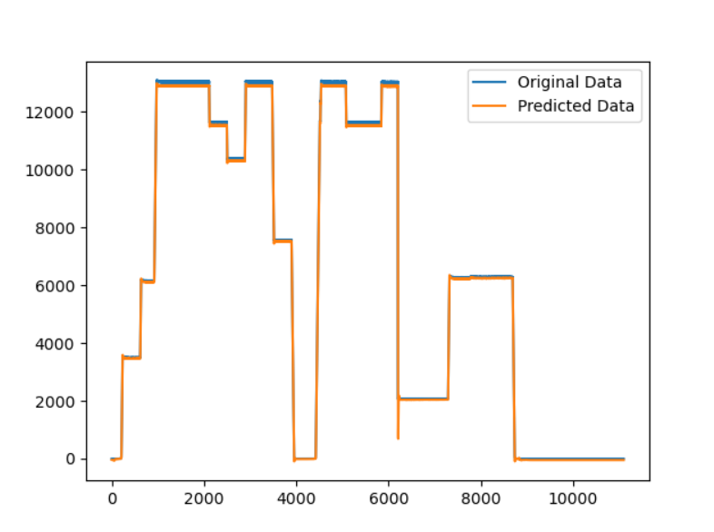

# 趋势预测报告（LSTM模型多变量预测）

[参考代码链接](**https://github.com/xiao21wei/technology**)

使用的数据集的实际变化趋势示例：


数据集参数：

结合实际变化趋势，我们将数据集的前五分之四的数据集作为训练数据集，共44495条数据；将数据集的后五分之一的数据集作为测试数据集，共11101条数据。

代码部分：

```python
import numpy as np
import pandas as pd
from keras import Sequential
from keras.layers import LSTM, Dropout, Dense
from keras.wrappers.scikit_learn import KerasRegressor
from matplotlib import pyplot as plt
from sklearn.model_selection import GridSearchCV
from sklearn.preprocessing import MinMaxScaler


def lstm_model_pro_test():
    df = pd.read_csv('Ng_GenPCal.csv', parse_dates=['time'], index_col=[0])
    print(df.shape)

    test_split = round(len(df) * 0.20)
    df_for_training = df[:-test_split]
    df_for_testing = df[-test_split:]
    print(df_for_training.shape)
    print(df_for_testing.shape)

    scaler = MinMaxScaler(feature_range=(0, 1))
    df_for_training_scaled = scaler.fit_transform(df_for_training)
    df_for_testing_scaled = scaler.transform(df_for_testing)

    trainX, trainY = createXY(df_for_training_scaled, 30)
    testX, testY = createXY(df_for_testing_scaled, 30)

    print("trainX Shape-- ", trainX.shape)
    print("trainY Shape-- ", trainY.shape)

    print("testX Shape-- ", testX.shape)
    print("testY Shape-- ", testY.shape)

    grid_model = KerasRegressor(build_fn=build_model, verbose=1, validation_data=(testX, testY))

    parameters = {'batch_size': [16, 32],
                  'epochs': [8, 10],
                  'optimizer': ['adam', 'Adadelta']}

    grid_search = GridSearchCV(estimator=grid_model, param_grid=parameters, cv=2)
    grid_search = grid_search.fit(trainX, trainY)

    # 输出最优的参数组合
    print(grid_search.best_params_)

    my_model = grid_search.best_estimator_.model

    # parameters = {'batch_size': 32,
    #               'epochs': 50,
    #               'optimizer': 'adam'}
    # # 使用parameters中的参数构建模型
    # my_model = build_model(parameters['optimizer'])
    # # 训练模型
    # my_model.fit(trainX, trainY, batch_size=parameters['batch_size'], epochs=parameters['epochs'], verbose=1, validation_data=(testX, testY))

    prediction = my_model.predict(testX)

    prediction_copies_array = np.repeat(prediction, 2, axis=-1)
    print(prediction_copies_array.shape)

    pred = scaler.inverse_transform(np.reshape(prediction_copies_array, (len(prediction), 2)))[:, 0]

    original_copies_array = np.repeat(testY, 2, axis=-1)
    original = scaler.inverse_transform(np.reshape(original_copies_array, (len(testY), 2)))[:, 0]

    # 将训练数据和测试数据绘制在一张图中
    plt.plot(df_for_training['GenPCal'], label='Training Data')
    plt.plot(df_for_testing['GenPCal'], label='Testing Data')
    plt.legend()
    plt.show()

    # 将预测数据和测试数据绘制在一张图中
    plt.plot(original, label='Original Data')
    plt.plot(pred, label='Predicted Data')
    plt.legend()
    plt.show()


def createXY(dataset, n_past):
    dataX = []
    dataY = []
    for i in range(n_past, len(dataset)):
        dataX.append(dataset[i - n_past:i, 0:dataset.shape[1]])
        dataY.append(dataset[i, 1])
    return np.array(dataX), np.array(dataY)


def build_model(optimizer):
    grid_model = Sequential()
    grid_model.add(LSTM(50, return_sequences=True, input_shape=(30, 2)))
    grid_model.add(LSTM(50))
    grid_model.add(Dropout(0.2))
    grid_model.add(Dense(1))

    grid_model.compile(loss='mean_squared_error', optimizer=optimizer)
    return grid_model


if __name__ == '__main__':
    lstm_model_pro_test()

```

在本次的预测过程中，我们希望通过时间和`Ng`的值，来共同预测`GenPCal`的值。首先，我们先绘制训练数据和测试数据的变化趋势。


我们注意到，LSTM 模型中需要考虑参数组合来得到最佳的模型，我们首先进行参数调优，使用的参数组合为：

```python
parameters = {'batch_size': [16, 32],
	'epochs': [8, 10],
	'optimizer': ['adam', 'Adadelta']}
```

运行后得到的最优参数组合为：

```python
{'batch_size': 16, 'epochs': 8, 'optimizer': 'adam'}
```

使用该参数组合，构建模型，可以得到如下的趋势预测曲线，我们将预测得到的趋势变化曲线和实际趋势变化曲线绘制到一张图表中，得到如下的图像。



结果显示，得到的趋势预测曲线基本符合实际情况，在绝大多数的测试点的预测数据和实际数据均能对应，预测结果较好，后续可以考虑继续进行参数调优，逐渐缩小最优参数的取值范围，并得到最优的参数组合。

