# 趋势预测报告（LSTM模型多变量预测）

[参考代码链接](**https://github.com/xiao21wei/technology**)

使用的数据集的实际变化趋势示例：

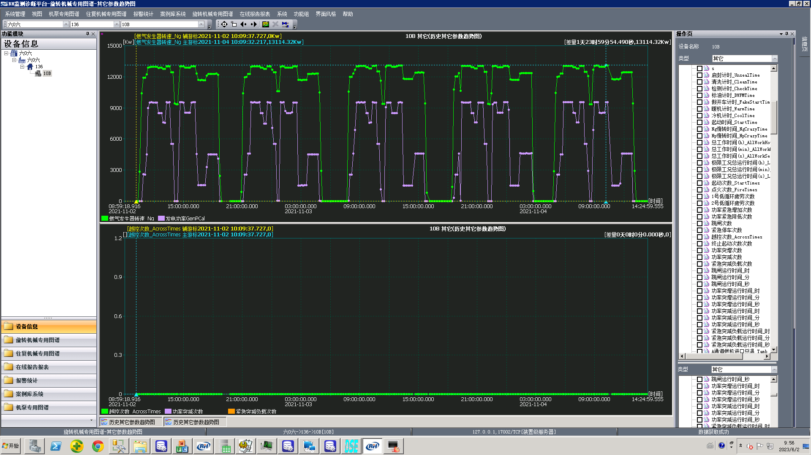


数据集参数：

结合实际变化趋势，我们将数据集的前五分之四的数据集作为训练数据集，共44495条数据；将数据集的后五分之一的数据集作为测试数据集，共11101条数据。

**本次测试我们预测的时间点前的30条燃气发生器转速`Ng`数据作为模型的输入，将发电功率`GenPCal`作为模型的输出，在测试数据集上对模型进行训练，并在测试数据集上对该模型进行测试。**

代码部分：

```python
# 构建lstm模型，进行多变量时序预测,Ng_GenPCal.csv文件中的数据为：time,Ng,GenPCal,需要预测的值为GenPCal
import numpy as np
import pandas as pd
from keras import Sequential
from keras.layers import LSTM, Dropout, Dense
from matplotlib import pyplot as plt
from sklearn.preprocessing import MinMaxScaler


def lstm_model_pro_test():
    df = pd.read_csv('Ng_GenPCal.csv', parse_dates=['time'], index_col=[0])
    print(df.shape)

    test_split = round(len(df) * 0.20)
    df_for_training = df[:-test_split]
    df_for_testing = df[-test_split:]
    print(df_for_training.shape)
    print(df_for_testing.shape)

    scaler = MinMaxScaler(feature_range=(0, 1))
    df_for_training_scaled = scaler.fit_transform(df_for_training)
    df_for_testing_scaled = scaler.transform(df_for_testing)

    trainX, trainY = createXY(df_for_training_scaled, 30)
    testX, testY = createXY(df_for_testing_scaled, 30)

    print("trainX Shape-- ", trainX.shape)
    print("trainY Shape-- ", trainY.shape)

    print("testX Shape-- ", testX.shape)
    print("testY Shape-- ", testY.shape)

    # grid_model = KerasRegressor(build_fn=build_model, verbose=1, validation_data=(testX, testY))

    # parameters = {
    #     'batch_size': [80, 96, 112],
    #     'epochs': [45],
    #     'optimizer': ['adam']
    # }
    #
    # grid_search = GridSearchCV(estimator=grid_model, param_grid=parameters, cv=2)
    # grid_search = grid_search.fit(trainX, trainY)
    #
    # # 输出最优的参数组合
    # print(grid_search.best_params_)
    #
    # my_model = grid_search.best_estimator_.model

    parameters = {'batch_size': 96,
                  'epochs': 45,
                  'optimizer': 'adam'
                  }
    # 使用parameters中的参数构建模型
    my_model = build_model(parameters['optimizer'])
    # 设置模型的batch_size和epochs
    my_model.fit(trainX, trainY, batch_size=parameters['batch_size'], epochs=parameters['epochs'])

    # 训练模型
    # my_model.fit(trainX, trainY)

    prediction = my_model.predict(testX)

    prediction_copies_array = np.repeat(prediction, 2, axis=-1)
    print(prediction_copies_array.shape)

    pred = scaler.inverse_transform(np.reshape(prediction_copies_array, (len(prediction), 2)))[:, 0]

    original_copies_array = np.repeat(testY, 2, axis=-1)
    original = scaler.inverse_transform(np.reshape(original_copies_array, (len(testY), 2)))[:, 0]

    # 将训练数据和测试数据绘制在一张图中
    plt.plot(df_for_training['GenPCal'], label='Training Data')
    plt.plot(df_for_testing['GenPCal'], label='Testing Data')
    plt.legend()
    plt.show()

    # 将预测数据和测试数据绘制在一张图中
    plt.plot(original, label='Original Data')
    plt.plot(pred, label='Predicted Data')
    plt.legend()
    plt.show()


def createXY(dataset, n_past):
    dataX = []
    dataY = []
    for i in range(n_past, len(dataset)):
        # dataX为前n_past天的Ng数据
        # dataY为第n_past天的GenPCal数据
        dataX.append(dataset[i - n_past:i, 0])
        dataY.append(dataset[i, 1])
    return np.array(dataX), np.array(dataY)


def build_model(optimizer):
    grid_model = Sequential()
    grid_model.add(LSTM(50, return_sequences=True, input_shape=(30, 1)))
    grid_model.add(LSTM(50))
    grid_model.add(Dropout(0.2))
    grid_model.add(Dense(1))

    grid_model.compile(loss='mean_squared_error', optimizer=optimizer)
    return grid_model


if __name__ == '__main__':
    lstm_model_pro_test()

```

在本次的预测过程中，我们希望通过时间和`Ng`的值，来共同预测`GenPCal`的值。首先，我们先绘制训练数据和测试数据的变化趋势。

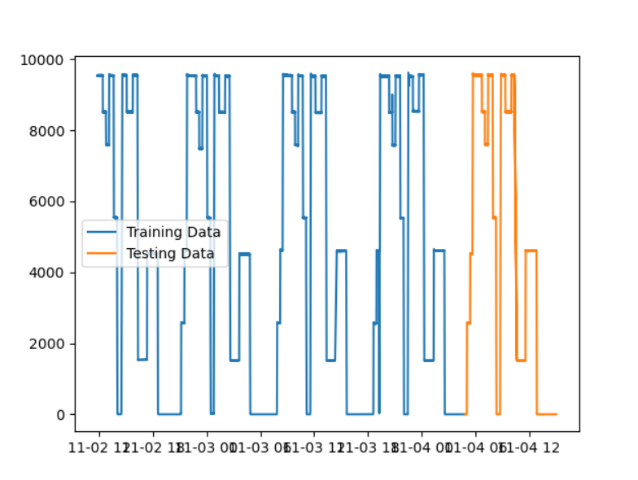

我们注意到，LSTM 模型中需要考虑参数组合来得到最佳的模型，我们首先进行参数调优。

待优化的参数组合：

```python
parameters = {'batch_size': [64, 128],
	'epochs': [20, 40],
	'optimizer': ['adam', 'Adadelta']}
```

此时的最优参数组合：

```python
{'batch_size': 64, 'epochs': 40, 'optimizer': 'adam'}
```

运行结果：

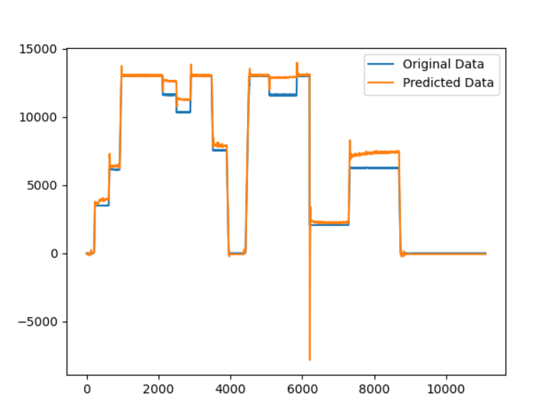

待优化的参数组合：

```python
parameters = {
    'batch_size': [32, 64, 96],
	'epochs': [30, 40, 50],
	'optimizer': ['adam']
}
```

此时的最优参数组合：

```python
{'batch_size': 96, 'epochs': 40, 'optimizer': 'adam'}
```

运行结果：

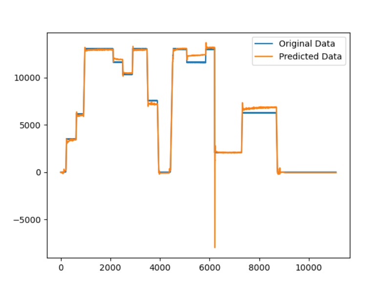

待优化的参数组合：

```python
parameters = {
        'batch_size': [80, 96, 112],
        'epochs': [40],
        'optimizer': ['adam']
    }
```

此时的最优参数组合：

```python
{'batch_size': 96, 'epochs': 40, 'optimizer': 'adam'}
```

运行结果：

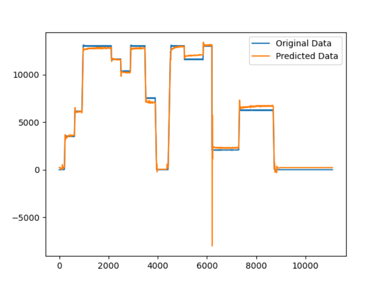

待优化的参数组合：

```python
parameters = {
        'batch_size': [96],
        'epochs': [35, 40, 45],
        'optimizer': ['adam']
    }
```

此时的最优参数组合：

```python
{'batch_size': 96, 'epochs': 45, 'optimizer': 'adam'}
```

运行结果：

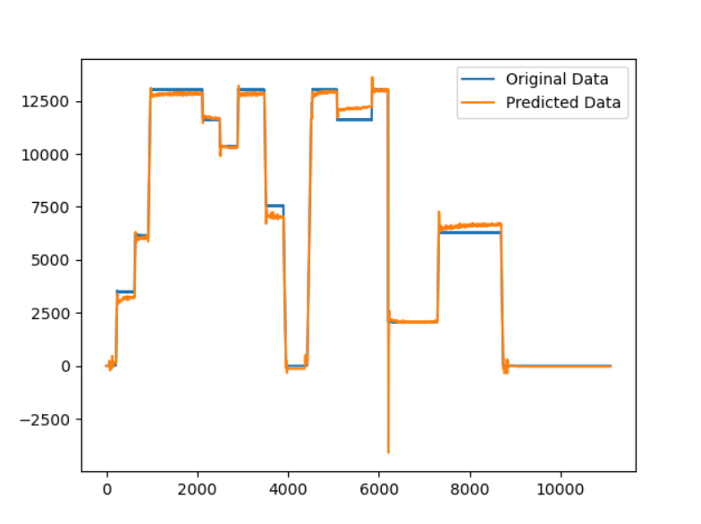

待优化的参数组合：

```python
parameters = {
        'batch_size': [80, 96, 112],
        'epochs': [45],
        'optimizer': ['adam']
    }
```

此时的最优参数组合：

```python
{'batch_size': 96, 'epochs': 45, 'optimizer': 'adam'}
```

运行结果：

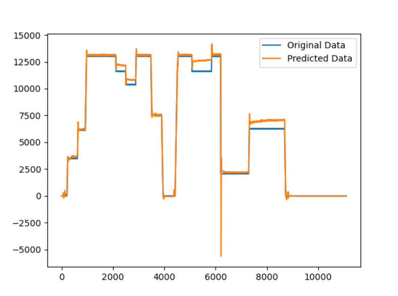

经过上述的多轮测试，我们逐步缩小该模型的最优参数的范围，最终确定如下的参数组合：

```
parameters = {'batch_size': 96,
                  'epochs': 45,
                  'optimizer': 'adam'
                  }
```

我们使用该模型，在训练数据集上对模型进行训练，并在测试数据集上对模型进行多次测试，得到如下结果：

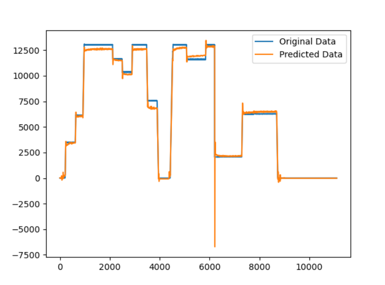

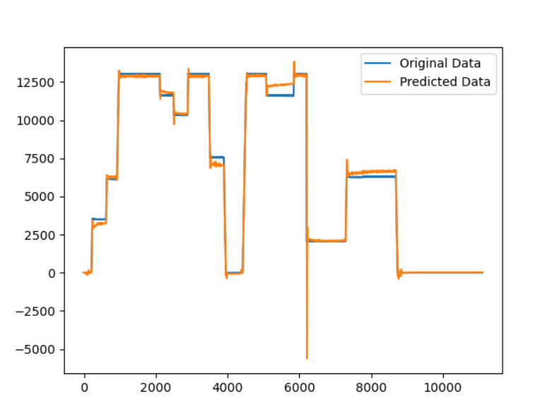

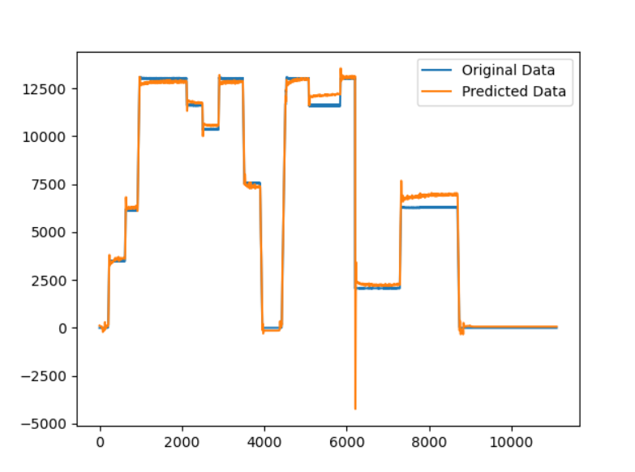

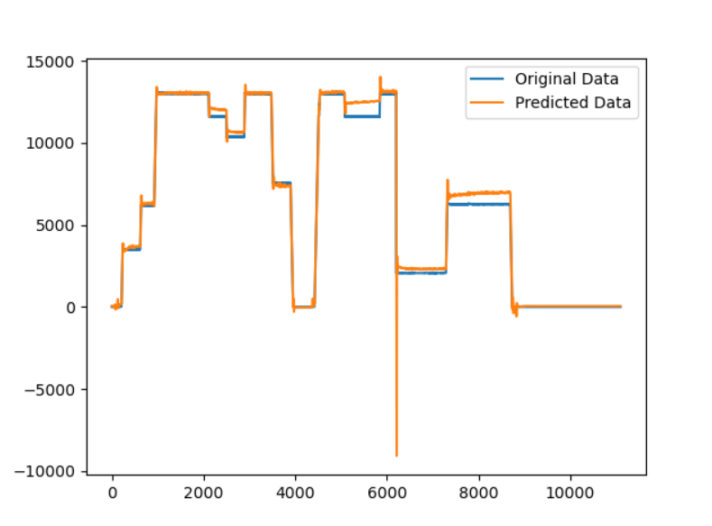

​		观察得到的趋势预测数据，我们可以发现，该模型在数据的整体变化趋势上表现较好，能够反映出数据的变化趋势，并且在绝大多数时间点上的预测结果都符合预期，和实际数据基本吻合。但是在部分数据的变化节点上，模型的预测数据和实际数据存在一定的差距，但是随着时间的延后，数据的变化趋势开始往真实数据靠近，说明该模型的预测结果较好，可通过增加训练数据来提升模型趋势预测的性能。

我们针对上述使用到的待优化的参数组合，即

```python
parameters = {
        'batch_size': [32, 64, 128, 256],
        'epochs': [20, 30, 40, 50],
        'optimizer': ['adam', 'rmsprop', 'SGD', 'Momentum']
    }
```

继续进行优化，其中，我们重点需要解决的是参数的相互影响。

对于参数的自动调整，有网格搜索和随机搜索两种常见的参数调优方式。我们发现该模型在目前的训练数据集上进行训练时，训练时间极长，考虑到时间成本的投入和得到的效果，我们选择调优所用时间相对较短的随机搜索的方式对该模型的参数进行调优。

核心代码部分如下：

```python
grid_model = KerasRegressor(build_fn=build_model, verbose=1, validation_data=(testX, testY))

    parameters = {
        'batch_size': [32, 64, 128, 256],
        'epochs': [20, 30, 40, 50],
        'optimizer': ['adam', 'rmsprop', 'SGD', 'Momentum']
    }

    grid_search = RandomizedSearchCV(estimator=grid_model, param_distributions=parameters, scoring='neg_mean_squared_error', cv=3, verbose=1)
    grid_search = grid_search.fit(trainX, trainY)

    # 输出最优的参数组合
    print(grid_search.best_params_)

    my_model = grid_search.best_estimator_.model
```

运行结果：

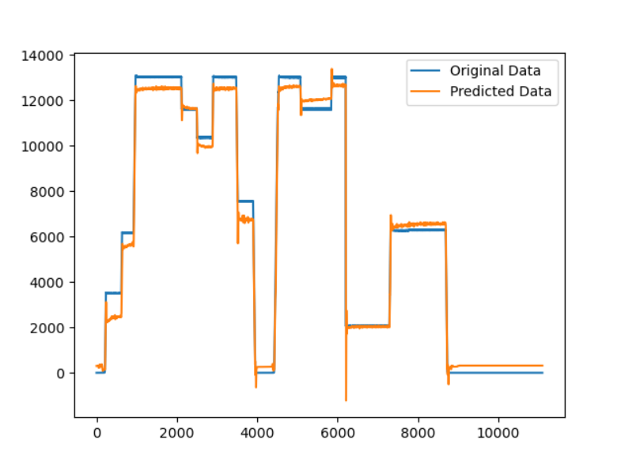

当前最优参数组合：

```
{'optimizer': 'rmsprop', 'epochs': 20, 'batch_size': 64}
```

使用该组参数进行多次模型的测试，测试结果如下：

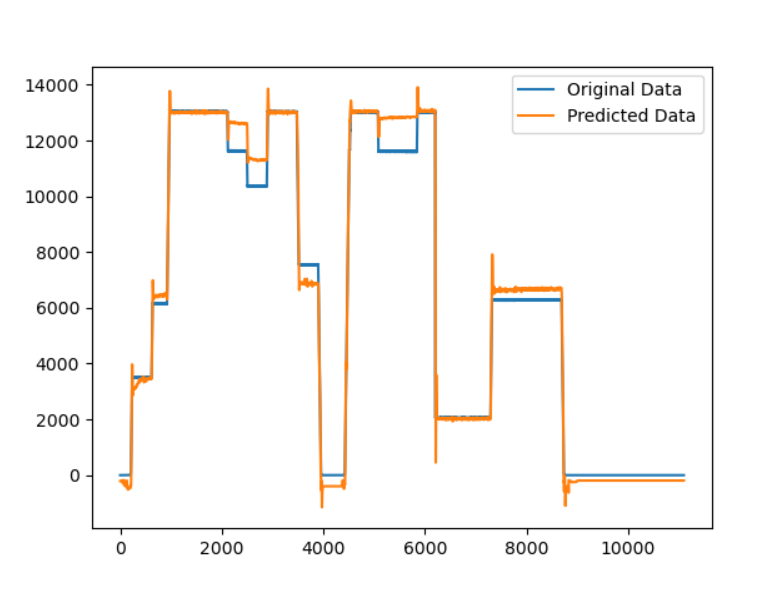

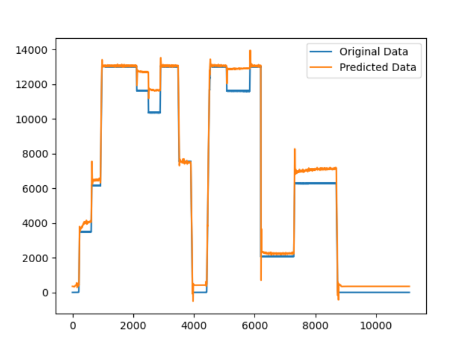

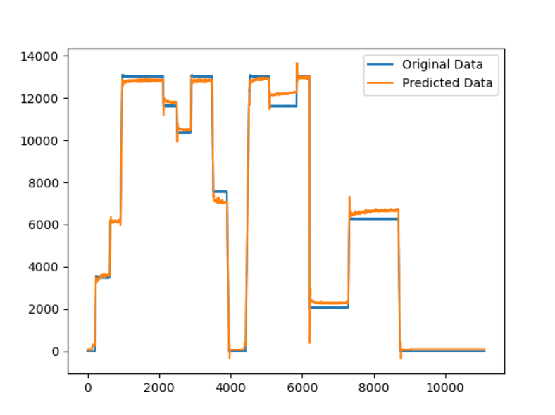

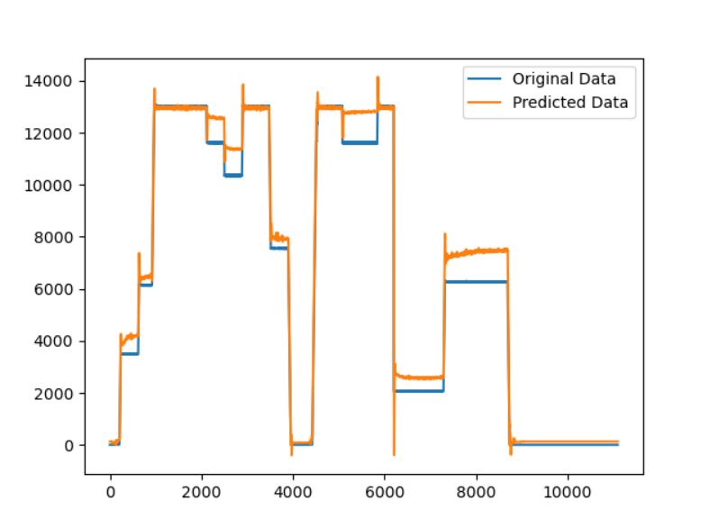

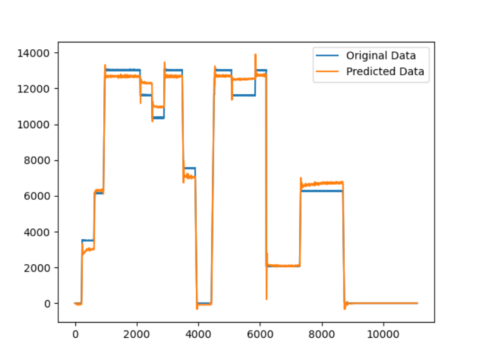

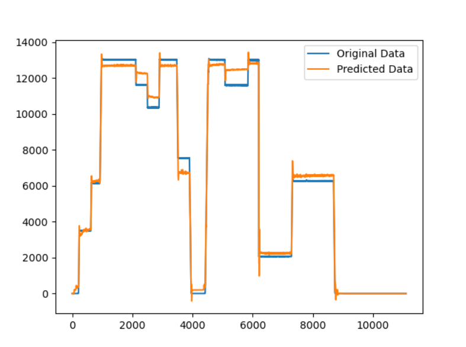

我们使用最新的参数来训练模型，并进行预测输出，发现输出结果相较于前一组参数，在数据的合理性上有了一定的提升，说明，不同的参数组合有可能会产生不合理的数据，当前的测试结果显示，目前的参数组合对于该场景下的模型来说，具有较好的预测效果。

我们尝试更换优化器，将模型使用的优化器更换为`adam`，观察得到的预测结果。

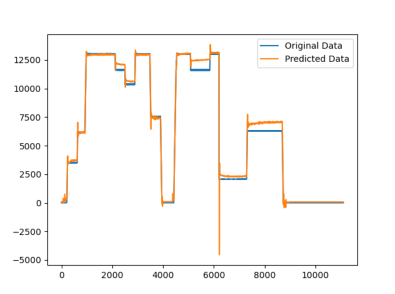

可以发现，之前的预测结果较差很有可能是由于优化器的选择不当，由此，我们针对优化器的选择策略，查询相关的资料后得出如下的关于优化器的选择建议。

1. Adam（Adaptive Moment Estimation）：Adam通常在深度学习任务中表现良好，特别是当数据集较大时。它结合了动量法和自适应学习率的特点，能够快速收敛并处理各种类型的数据。
2. RMSprop（Root Mean Square Propagation）：RMSprop适用于训练循环神经网络（如LSTM）等序列模型，以及具有非平稳梯度分布的问题。它通过对梯度平方的移动平均进行调整学习率，有助于稳定训练过程。
3. SGD（Stochastic Gradient Descent）：SGD是最基本的优化算法，在训练小型数据集或浅层模型时仍然有效。它的简单性使得它容易实现和调试，并且在某些情况下可以得到较好的结果。
4. Adagrad（Adaptive Gradient Algorithm）：Adagrad适用于稀疏数据集和非平稳目标函数的问题。它通过自适应地调整每个参数的学习率，使得较少出现的特征获得更大的学习率，有助于更好地处理稀疏梯度。

当我们选择使用`rmsprop`优化器时，预测结果有了明显的提升。

针对`rmsprop`优化器得到的预测结果：


虽然，该预测结果依然存在部分不合理的预测值，但可以发现，这些预测值集中出现在趋势的突变点上，考虑到我们训练和预测模型使用的是预测时间点前30个数据，这个偏离真实值的数据在一定程度上是在可接受范围内的，由此该模型使用的参数是较为合理的，后续可继续使用该参数组合来构建模型，并使用现有的数据进行训练，当训练后的数据在测试数据集上表现较好时，即可将该模型用于实际的场景进行趋势预测。


现在我们重点解决预测结果中出现的极为不合理的预测数据。

考虑到该预测的实际情景，我们适当增加该模型的批处理大小（batch_size）和迭代次数（epochs）来优化模型。此外，考虑到实际情况，我们适当调整用于训练和测试的数据集，我们将需要预测的时间点前50条数据作为输入，输入的字段包括`Ng`和`GenPCal`，输出为预测数据。

通过查询LSTM模型的相关资料，我发现模型在训练时选择的优化算法，会对模型的预测结果产生一定程度的影响。所以我们分别使用常用的优化算法来进行测试，分析测试结果。

```
parameters = {
	'batch_size': 128,  # 批处理大小
	'epochs': 40,  # 迭代次数
	}
```

对于`adam`算法：

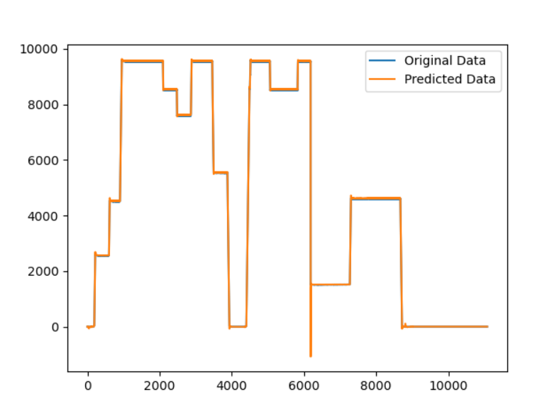

在大部分数据点，预测结果较好，但是存在极为不合理的数据，即对于均为非负数的数据集，预测结果出现负值。

对于`rmsprop`算法：

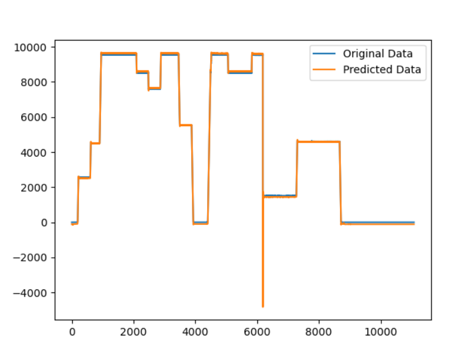

在大部分数据点上的预测结果均较好，但是，和`adam`算法下的不合理数据一样，出现了非常不合理的预测数据。

对于`SGD`算法：


在该优化算法下，我们使用LSTM模型预测得到的预测结果在绝大部分数据点上的预测结果均较好，并且在前两种优化算法表现较差的数据点上也有较好的预测效果。

对于`Adagrad`算法：

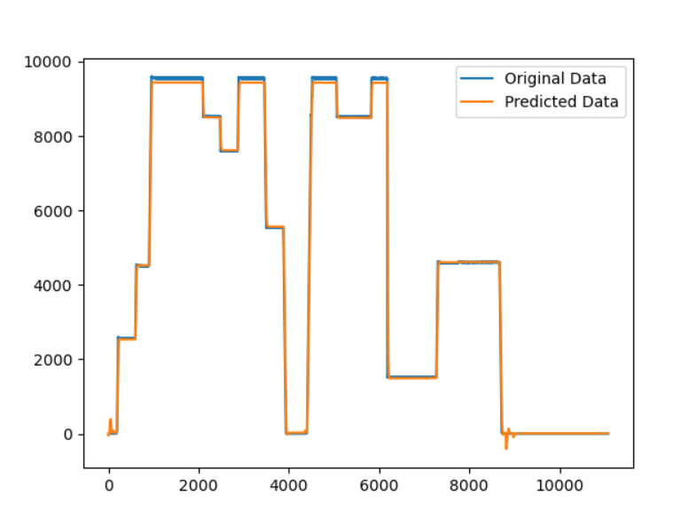

我们发现，在大部分数据点上的预测结果还是不错的，但是在部分数据点上，预测数据和真实数据之间存在一定的差别。

原因解析：

> Adam 算法结合了 AdaGrad 和 RMSProp 的思想，并引入了动量项。它能自适应地调整学习率，在优化过程中可以更快地收敛到较小的损失值。然而，当应用于某些任务时，Adam 可能会导致不合理的预测结果。
>
> Adam 算法对于某些数据集或特定的问题可能过度拟合，导致模型过度优化训练数据，而无法很好地泛化到测试数据上。这可能会导致过度自信的预测，从而产生不合理的结果。
>
> 相比之下，SGD 是一种更简单的优化算法，它在每个权重更新步骤中仅考虑当前样本的梯度。由于其较低的复杂性，SGD 在某些情况下可能表现更稳定，尤其是在数据集较小、噪声较多或者存在较多局部最小值的情况下。

综上所述，我们可以选择`SGD`优化算法来完成后续的优化。

构建模型使用的参数，以及模型测试后得到的均方误差：
```python
{'batch_size': 32, 'epochs': 30, 'optimizer': 'SGD'}
MSE--  35974.026754833896
# 存在过拟合
```

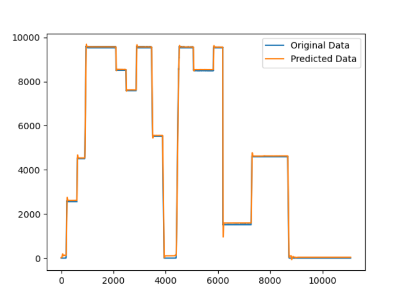

```python
{'batch_size': 64, 'epochs': 30, 'optimizer': 'SGD'}
MSE--  47470.6039708683
```


```python
{'batch_size': 128, 'epochs': 30, 'optimizer': 'SGD'}
MSE--  60839.89841547627
```

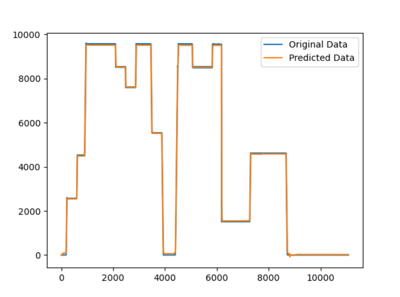

```python
{'batch_size': 256, 'epochs': 30, 'optimizer': 'SGD'}
MSE--  71448.75254454627
```

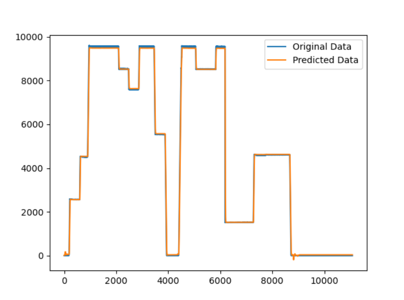

```python
{'batch_size': 32, 'epochs': 40, 'optimizer': 'SGD'}
MSE--  32263.72442535433
# 存在过拟合
```


```python
{'batch_size': 64, 'epochs': 40, 'optimizer': 'SGD'}
MSE--  42505.31197342462
# 存在过拟合
```


```python
{'batch_size': 128, 'epochs': 40, 'optimizer': 'SGD'}
MSE--  50514.90813676194
```

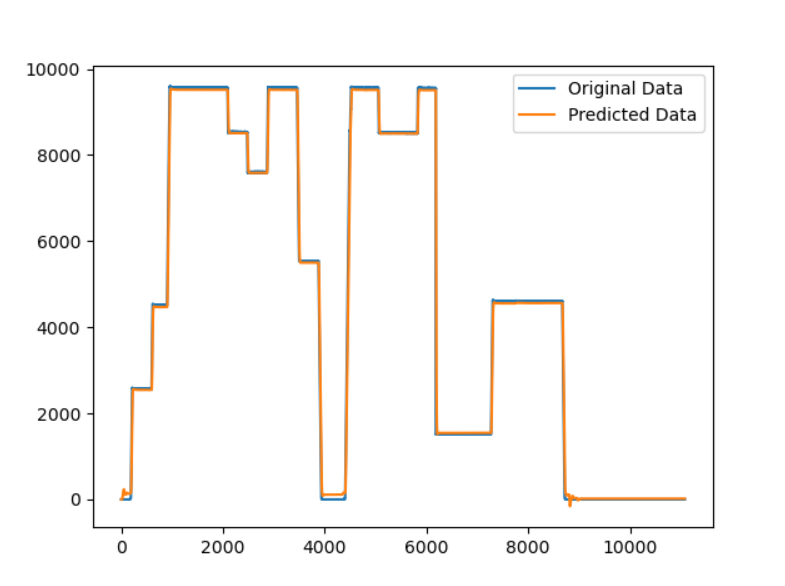

```python
{'batch_size': 256, 'epochs': 40, 'optimizer': 'SGD'}
MSE--  53162.9721900545
```


```python
{'batch_size': 32, 'epochs': 50, 'optimizer': 'SGD'}
MSE--  30170.08287766897
# 存在过拟合
```

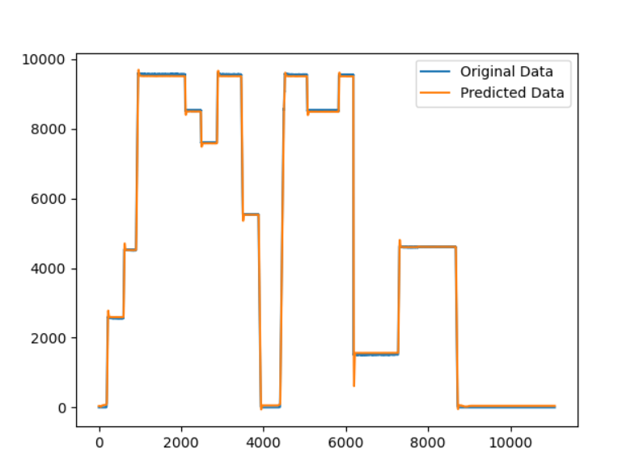

```python
{'batch_size': 64, 'epochs': 50, 'optimizer': 'SGD'}
MSE--  37671.06833111898
# 存在过拟合
```

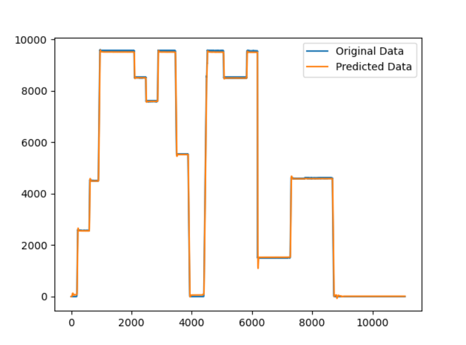

```python
{'batch_size': 128, 'epochs': 50, 'optimizer': 'SGD'}
MSE--  51933.44713487485
```

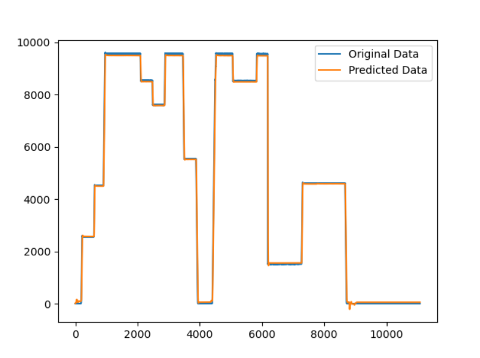

```python
{'batch_size': 256, 'epochs': 50, 'optimizer': 'SGD'}
MSE--  64840.196967190146
```

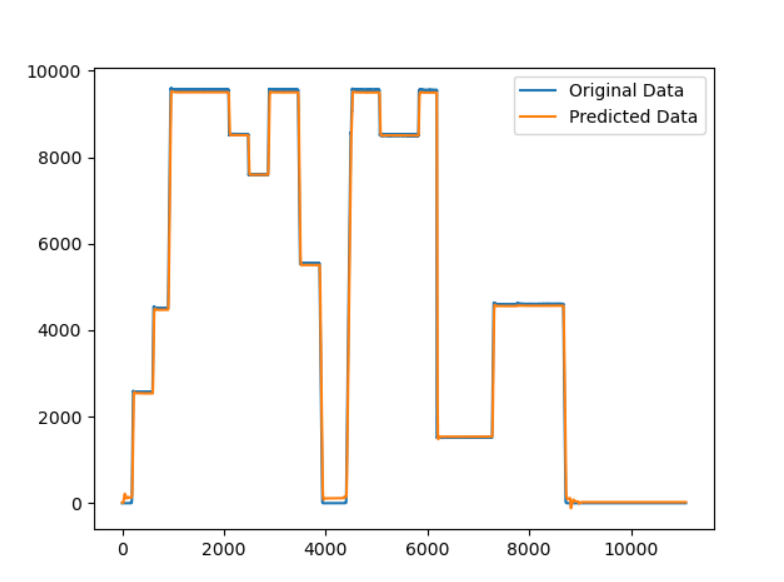

在上述的多轮测试中，我们分别使用不同的批处理大小（batch_size）和迭代次数（epochs）来构建模型，用于时序预测。我们发现当参数发生变化时，部分参数组合得到的预测结果依然出现了过拟合的现象。综合考虑预测结果的合理性，过拟合现象，训练时间成本，均方误差等因素，最终确定的效果较好的模型参数组合如下;

```
{'batch_size': 128, 'epochs': 40, 'optimizer': 'SGD'}

{'batch_size': 128, 'epochs': 50, 'optimizer': 'SGD'}
```

这两组参数得到的结果分别为


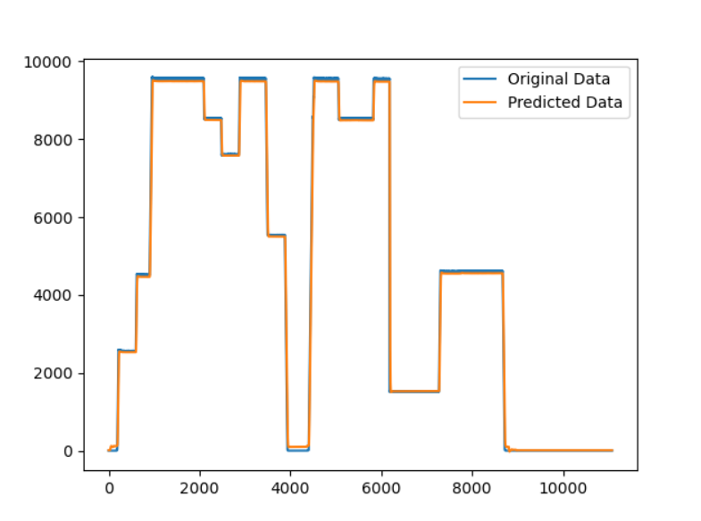
