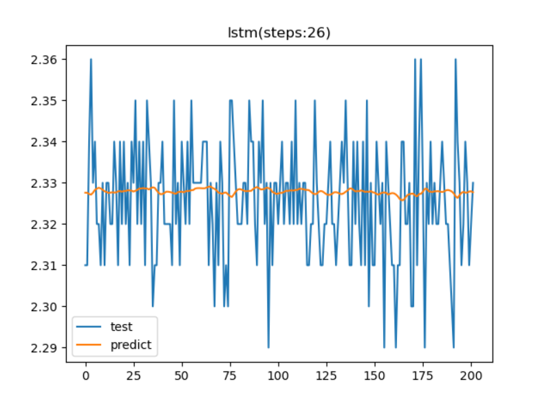

# 趋势预测报告（LSTM模型）

[参考代码链接](**https://github.com/xiao21wei/technology**)

该报告重点关注LSTM模型的参数调优问题，通过使用不同的参数组合来构建模型，比较不同模型下的预测结果，比较结果，得出最优参数。最后我们使用得到的最优参数组合来构建模型，并使用该模型进行趋势预测。

我们首先需要通过测试来得出，趋势预测效果最好的时间步个数。我们依次将时间步设置为1~30，分别用这些时间步个数构建模型，并进行训练和预测，通过比较预测的结果来得出最优的时间步个数，用于后续的趋势预测。

```python
import os
import numpy as np
import pandas as pd
from datetime import datetime

from keras import Sequential
from keras.layers import Dropout, LSTM, Dense
from matplotlib import pyplot as plt
from sklearn.preprocessing import MinMaxScaler

os.environ['TF_CPP_MIN_LOG_LEVEL'] = '2'


def lstm_model_test(csv_file, steps, scorel):
    # Load the data
    custom_date_parser = lambda x: datetime.strptime(x, "%Y-%m-%d %H:%M:%S")
    df = pd.read_csv(csv_file, parse_dates=['trendTime'], date_parser=custom_date_parser, index_col='trendTime')
    # Rename the columns
    last_data_time = df.index[-1]

    start_time = pd.to_datetime(last_data_time) - pd.Timedelta(days=1) - pd.Timedelta(days=7)
    start_time = start_time.strftime('%Y-%m-%d %H:%M:%S')
    print(start_time)

    # last_data_time为%Y-%m-%d %H:%M:%S格式
    mid_time = pd.to_datetime(last_data_time) - pd.Timedelta(days=1)
    mid_time = mid_time.strftime('%Y-%m-%d %H:%M:%S')
    print(mid_time)

    end_time = pd.to_datetime(mid_time) + pd.Timedelta(days=1)
    end_time = end_time.strftime('%Y-%m-%d %H:%M:%S')
    print(end_time)

    df = df.iloc[::300, :]

    # 划分训练集和测试集
    train_df = df[(df.index < mid_time) & (df.index > start_time)].values
    test_df = df[(df.index >= mid_time) & (df.index < end_time)].values

    print(train_df.shape)
    print(test_df.shape)

    sc = MinMaxScaler(feature_range=(0, 1))
    train_df_scaled = sc.fit_transform(train_df)

    x_train = []
    y_train = []
    for i in range(steps, train_df_scaled.shape[0]):
        x_train.append(train_df_scaled[i-steps:i, 0])
        y_train.append(train_df_scaled[i, 0])

    x_train, y_train = np.array(x_train), np.array(y_train)

    x_train = np.reshape(x_train, (x_train.shape[0], x_train.shape[1], 1))

    # 构建只有一层的LSTM模型
    model = Sequential()
    model.add(LSTM(units=128, return_sequences=True, input_shape=(x_train.shape[1], 1)))
    model.add(Dropout(0.2))

    model.add(LSTM(units=128))
    model.add(Dropout(0.2))

    model.add(Dense(units=1))

    model.compile(optimizer='rmsprop', loss='mse')

    model.fit(x_train, y_train, epochs=20, batch_size=32)

    # 获取train_df的最后steps个数据，用于预测
    df1 = df.tail(steps)
    test_df1 = df[(df.index >= mid_time) & (df.index < end_time)]
    inputs = pd.concat([df1, test_df1], axis=0).values

    inputs = inputs.reshape(-1, 1)
    inputs = sc.transform(inputs)
    x_test = []
    for i in range(steps, inputs.shape[0]):
        x_test.append(inputs[i - steps:i, 0])
    x_test = np.array(x_test)

    x_test = np.reshape(x_test, (x_test.shape[0], x_test.shape[1], 1))

    predict_test = model.predict(x_test)  # 预测
    predict_test = sc.inverse_transform(predict_test)  # 反归一化

    score = model.evaluate(x_test, test_df1.values)
    scorel.append(score)
    print(score)

if __name__ == "__main__":
    scorel = []
    for steps in range(1, 31):
        lstm_model_test("cs4.csv", steps, scorel)
    # 输出最大值对应的索引
    print(scorel.index(max(scorel)) + 1)
    plt.plot(range(1, 30), scorel)
    plt.show()
```


结果显示当时间步个数为26时，预测效果最佳，所以后续的预测过程，我们将把26作为时间步个数用于构建模型。

**数据参数**

| 参数             | 值                    |
| ---------------- | --------------------- |
| 开始时间         | 2023-04-26 16: 04: 14 |
| 分隔时间         | 2023-05-03 16: 04: 14 |
| 结束时间         | 2023-05-04 16: 04: 14 |
| 训练数据集数据量 | 133436                |
| 测试数据集数据量 | 20254                 |

我们尝试每10个数据取一个进行训练和测试

此时用于训练和测试的数据量分别为13343和2026


我们尝试每100个数据取一个进行训练和测试

此时用于训练和测试的数据量分别为1335和202



我们尝试每300个数据取一个进行训练和测试

此时用于训练和测试的数据量分别为445和68


我们尝试每500个数据取一个进行训练和测试

此时用于训练和测试的数据量分别为267和40


我们尝试每1000个数据取一个进行训练和测试

此时用于训练和测试的数据量分别为133和20


每100条数据取一个数据时，模型预测得到的趋势曲线的走势能够更好地呈现出来，所以在后续的测试过程中我们将继续使用每100条数据取一个数据的形式来，得到更好的预测结果。

```python
param_grid = {
        'batch_size': [32, 64, 128],  # batch_size是指进行梯度下降时每个batch包含的样本数
        'epochs': [20, 50, 100],  # epochs是指训练过程中数据将被“轮”多少次
        'optimizer': ['rmsprop', 'adam', 'sgd']  # optimizer是指优化器
    }

    all_params = [dict(zip(param_grid.keys(), v)) for v in itertools.product(*param_grid.values())]
    scorel = []  # 用来记录不同参数组合对应的rmse
    for params in all_params:
        m = Sequential()
        m.add(LSTM(units=128, return_sequences=True, input_shape=(x_train.shape[1], 1)))
        m.add(Dropout(0.2))

        m.add(LSTM(units=128))
        m.add(Dropout(0.2))

        m.add(Dense(units=1))

        m.compile(optimizer=params['optimizer'], loss='mse')
        m.fit(x_train, y_train, epochs=params['epochs'], batch_size=params['batch_size'])
        predict_test = m.predict(x_test)  # 预测
        predict_test = sc.inverse_transform(predict_test)  # 反归一化

        score = m.evaluate(x_test, test_df1.values)
        scorel.append(score)

    # 输出最佳参数组合
    print('best params: ', all_params[np.argmin(scorel)])
```

此时的最优参数为;

```bash
best params:  {'batch_size': 128, 'epochs': 50, 'optimizer': 'rmsprop'}
```


从模型的预测结果可以看出，此时预测得到的趋势变化曲线，已经能够较为清晰地展现出数据的变化趋势，当真实的数据点总体呈上升趋势时，趋势预测曲线也呈上升趋势，当真实数据点呈下降趋势时，趋势预测曲线也呈下降趋势，符合实验预期结果。但是，我们可以发现，该模型得到的趋势预测曲线只能在一定程度上反应数据的变化趋势，在数据的数值预测上的准确度还有待提升，这部分提升可以通过对不同的参数组合进行测试，并比较预测结果，不断缩小最优参数组合的范围，最终确定最优参数，用于模型构建。
