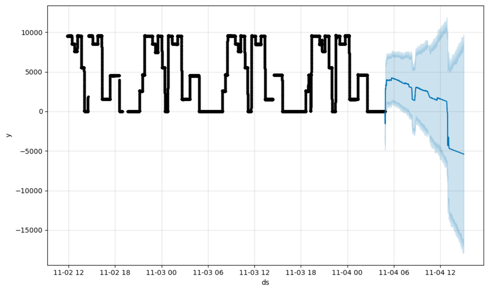
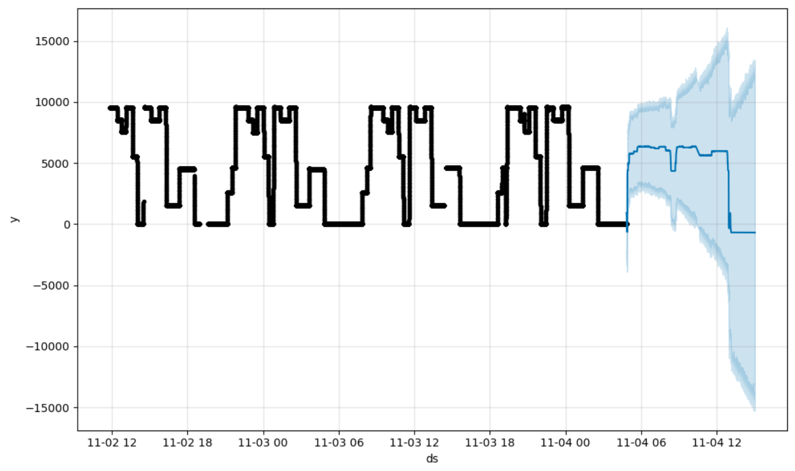
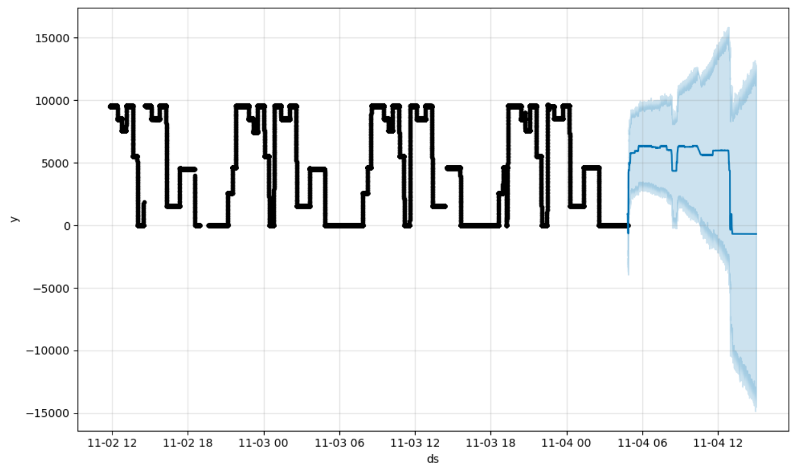
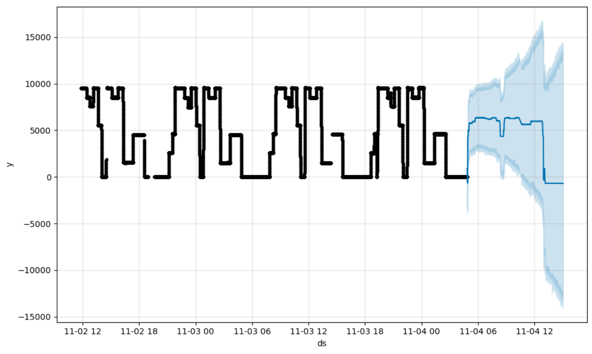
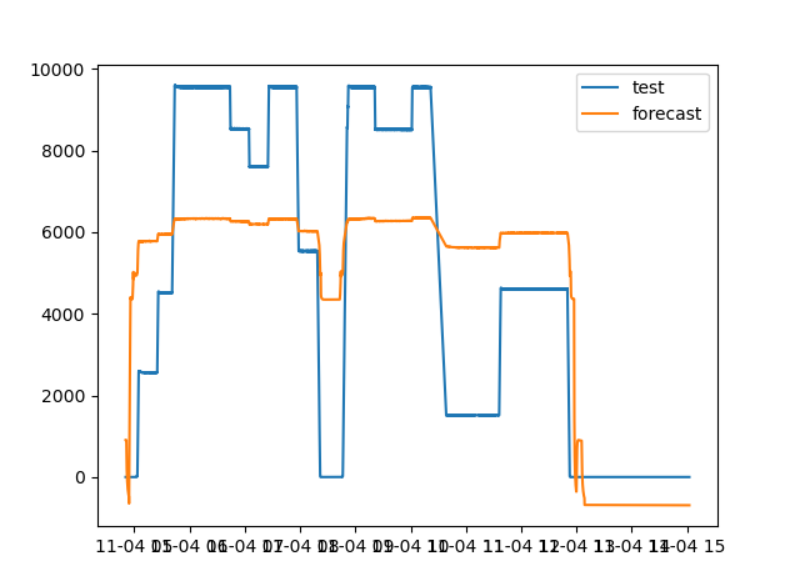

# 趋势预测报告（prophet模型多变量预测）

[参考代码链接](**https://github.com/xiao21wei/technology**)

数据集参数：

结合实际变化趋势，我们将数据集的前五分之四的数据集作为训练数据集，共44525条数据；将数据集的后五分之一的数据集作为测试数据集，共11131条数据。

核心代码部分：

```python
param_grid = {
    'n_changepoints': [i for i in range(10, 30)],
    'changepoint_range': [i / 10 for i in range(3, 10)],
    'seasonality_mode': ['additive', 'multiplicative'],
    'seasonality_prior_scale': [0.05, 0.1, 0.5, 1, 5, 10, 15],
    'interval_width': [0.8, 0.85, 0.9, 0.95]
}

all_params = [dict(zip(param_grid.keys(), v)) for v in itertools.product(*param_grid.values())]
rmses = []  # 用于存储各个参数集对应的RMSE误差

# Use cross validation to evaluate all parameters
for params in all_params:
    m = Prophet(**params).fit(df_for_training) 
    df_cv = m.predict(df_for_testing)  # Make predictions
    df_p = df_cv[['ds', 'yhat']].join(df_for_testing[['ds', 'y']].set_index('ds'), on='ds')  # Predictions and test data
    df_p.dropna(inplace=True)
    rmses.append((params, (df_p['y'] - df_p['yhat']).apply(lambda x: x ** 2).mean() ** 0.5))

# Find the best parameters
best_params = all_params[rmses.index(min(rmses, key=lambda x: x[1]))]
print(best_params)
```

我们通过如上代码对预设的参数组合进行测试，比较不同的参数组合得到的模型预测结果，从这些模型中选择出结果最优的模型对应的参数组合并输出，使用该参数组合构建模型，使用训练数据集训练模型，并在测试数据集上进行趋势预测，将此时的预测数据和真实数据绘制在一张图表中，比较测试数据和真实数据的差异，评估模型预测的结果。

待优化的参数组合：

```python
param_grid = {
        'n_changepoints': [i for i in range(10, 30)],
        # 'changepoint_range': [i / 10 for i in range(3, 10)],
        # 'seasonality_mode': ['additive', 'multiplicative'],
        # 'seasonality_prior_scale': [0.05, 0.1, 0.5, 1, 5, 10, 15],
        # 'interval_width': [0.8, 0.85, 0.9, 0.95]
    }
```

运行结果：



当前最优参数组合：

```python
{'n_changepoints': 11}
```

待优化的参数组合：

```python
param_grid = {
        'n_changepoints': [11],
        'changepoint_range': [i / 10 for i in range(3, 10)],
        # 'seasonality_mode': ['additive', 'multiplicative'],
        # 'seasonality_prior_scale': [0.05, 0.1, 0.5, 1, 5, 10, 15],
        # 'interval_width': [0.8, 0.85, 0.9, 0.95]
    }
```

运行结果：



当前最优参数组合：

```python
{'n_changepoints': 11, 'changepoint_range': 0.3}
```

待优化的参数组合：

```python
param_grid = {
        'n_changepoints': [11],
        'changepoint_range': [0.3],
        'seasonality_mode': ['additive', 'multiplicative'],
        # 'seasonality_prior_scale': [0.05, 0.1, 0.5, 1, 5, 10, 15],
        # 'interval_width': [0.8, 0.85, 0.9, 0.95]
    }
```

运行结果：


当前最优参数组合：

```python
{'n_changepoints': 11, 'changepoint_range': 0.3, 'seasonality_mode': 'additive'}
```

待优化的参数组合：

```python
param_grid = {
        'n_changepoints': [11],
        'changepoint_range': [0.3],
        'seasonality_mode': ['additive'],
        'seasonality_prior_scale': [0.05, 0.1, 0.5, 1, 5, 10, 15],
        # 'interval_width': [0.8, 0.85, 0.9, 0.95]
    }
```

运行结果：


当前最优参数组合：

```python
{'n_changepoints': 11, 'changepoint_range': 0.3, 'seasonality_mode': 'additive', 'seasonality_prior_scale': 0.05}
```

待优化的参数组合：

```python
param_grid = {
        'n_changepoints': [11],
        'changepoint_range': [0.3],
        'seasonality_mode': ['additive'],
        'seasonality_prior_scale': [0.05],
        'interval_width': [0.8, 0.85, 0.9, 0.95]
    }
```

运行结果：



当前最优参数组合：

```python
{'n_changepoints': 11, 'changepoint_range': 0.3, 'seasonality_mode': 'additive', 'seasonality_prior_scale': 0.05, 'interval_width': 0.8}
```

经过一定程度的参数调优，最终得到的最优参数组合为：

```python
param = {
        'n_changepoints': 11,
        'changepoint_range': 0.3,
        'seasonality_mode': 'additive',
        'seasonality_prior_scale': 0.05,
        'interval_width': 0.8
    }
```

运行得到的结果如下：





最终我们得到基于`Ng`变量，对`GenPCal`变量的趋势预测。预测结果显示，在预测变量的变化趋势上，预测得到的数据趋势变化曲线和真实数据的变化趋势基本吻合，在数据点的数据上，预测数据和真实数据之间存在一定的偏差，但是数据的偏差较小，可通过进一步优化模型来减小数据预测的偏差。