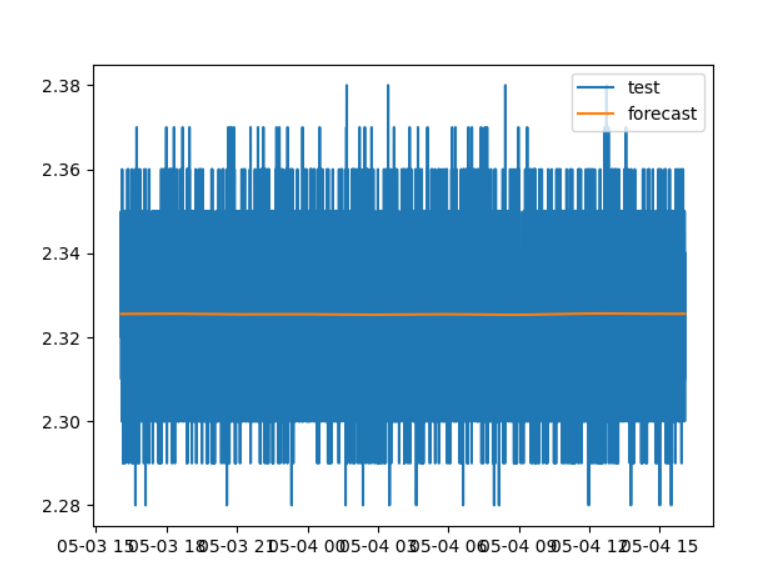

# 趋势预测报告（prophet模型）

```python
param_grid = {
        'n_changepoints': [5, 10, 15, 20, 25, 30, 35, 40, 45, 50],
    }
```

此时最优参数为30

```python
param_grid = {
        'n_changepoints': [26, 27, 28, 29, 30, 31, 32, 33, 34],
    }
```

此时最优参数为30

说明，对于参数`n_changepoints`，最优参数为30

```
param_grid = {
        'n_changepoints': [30],
        'changepoint_range': [0.5, 0.6, 0.7, 0.8, 0.9],
    }
```

此时最优参数为0.6

```
param_grid = {
        'n_changepoints': [30],
        'changepoint_range': [0.50, 0.55, 0.6, 0.65, 0.70],
    }
```

此时最优参数为0.6


```
param_grid = {
        'n_changepoints': [30],
        'changepoint_range': [0.55, 0.56, 0.57, 0.58, 0.59, 0.60, 0.61, 0.62, 0.63, 0.64, 0.65],
    }
```

此时最优参数为0.6

```
'changepoint_prior_scale': [0.01, 0.1, 0.5, 1],
param_grid = {
        'n_changepoints': [30],
        'changepoint_range': [0.6],
        'changepoint_prior_scale': [0.01, 0.1, 0.5, 1],
    }
```

此时最优参数是0.5

```
param_grid = {
        'n_changepoints': [30],
        'changepoint_range': [0.6],
        'changepoint_prior_scale': [0.5],
        'daily_seasonality': [True],
        'seasonality_mode': ['multiplicative', 'additive'],
    }
```

此时最优参数为additive

```
param_grid = {
        'n_changepoints': [30],
        'changepoint_range': [0.6],
        'changepoint_prior_scale': [0.5],
        'daily_seasonality': [True],
        'seasonality_mode': ['additive'],
        'seasonality_prior_scale': [0.1, 0.5, 1, 5, 10, 15, 20],
    }
```

此时最优参数为1

```
param_grid = {
        'n_changepoints': [30],
        'changepoint_range': [0.6],
        'changepoint_prior_scale': [0.5],
        'daily_seasonality': [True],
        'seasonality_mode': ['additive'],
        'seasonality_prior_scale': [1],
        'interval_width': [0.1, 0.2, 0.3, 0.4, 0.5, 0.6, 0.7, 0.8, 0.9],
    }
```

此时最优参数为0.1

```
param_grid = {
        'n_changepoints': [30],
        'changepoint_range': [0.6],
        'changepoint_prior_scale': [0.5],
        'daily_seasonality': [True],
        'seasonality_mode': ['additive'],
        'seasonality_prior_scale': [1],
        'interval_width': [0.1],
        'uncertainty_samples': [500, 1000, 1500, 2000, 2500, 3000, 3500, 4000, 4500, 5000],
    }
```

此时最优参数为500

经过以上的测试，我们得出了对于该预测情景下，最优的参数组合

```
best_params = {
        'n_changepoints': 30,
        'changepoint_range': 0.6,
        'changepoint_prior_scale': 0.5,
        'daily_seasonality': True,
        'seasonality_mode': 'additive',
        'seasonality_prior_scale': 1,
        'interval_width': 0.1,
        'uncertainty_samples': 500,
    }
```

我们使用这组最优参数来搭建prophet模型，并使用前7天的测点数据进行训练，并在第8天的数据上进行测试，比较预测得到的数据和真实数据

使用默认参数时的预测情况：




使用最优参数时的预测情况：


对比之后发现，通过调整模型从参数并不能有效提升该模型的预测性能，说明该情景下，出现prophet模型的预测效果较差的情况，参数并不是主要影响因素，所以，我们接下来从用于训练和测试的数据本身入手，通过对数据进行一定程度的处理，来提升模型的性能。

用于训练和测试的数据量分别为133436和20254

我们尝试每10个数据取一个进行训练和测试

此时用于训练和测试的数据量分别为13344和2026


我们发现数据在变化趋势上有了明显的波动，但目前仍然无法评价该模型的预测效果，因为数据的变化趋势依旧不明显，所以，接下来，我们重点关注这部分的数据调整内容。

我们尝试每100个数据取一个进行训练和测试

此时用于训练和测试的数据量分别为1335和203


我们尝试每100个数据取一个进行训练和测试

此时用于训练和测试的数据量分别为134和21


我们发现预测趋势的变化幅度进一步增大，这是增大数据间隔的必然结果。随着数据点之间的间距不断扩大，相邻数据点之间的影响逐渐减小，数据变化较大的数据点在数据集中的比重增大，在进行测试数据集的预测时，可以明显发现，预测数据的趋势变化和真实数据的变化情况出现了较为严重的偏差，现在这种情况下，该模型并不适合用来对后续的数据进行预测。