# 趋势预测报告（randomForest模型多变量预测）

[参考代码链接](**https://github.com/xiao21wei/technology**)

数据集参数：

结合实际变化趋势，我们将数据集的前五分之四的数据集作为训练数据集，共44525条数据；将数据集的后五分之一的数据集作为测试数据集，共11131条数据。

核心代码部分：

```python
# 将Ng的值作为特征，将GenPCal的值作为标签，构建训练集和测试集
    x_train = df.iloc[:train_split, 1:2]
    y_train = df.iloc[:train_split, 2:3]
    x_test = df.iloc[train_split:, 1:2]
    y_test = df.iloc[train_split:, 2:3]
    y_train = np.array(y_train).reshape(-1)

    # 构建模型，并进行调参
    param_grid = {
        'n_estimators': [200],
        'max_depth': [3, 4, 5, 6, 7],
        # 'min_samples_split': [2, 3, 4, 5, 6],
        # 'min_samples_leaf': [1, 2, 3, 4, 5],
        # 'max_features': ['sqrt', 'log2']
    }

    all_params = [dict(zip(param_grid.keys(), v)) for v in itertools.product(*param_grid.values())]
    rmses = []
    for params in all_params:
        model = RandomForestRegressor(**params)
        model.fit(x_train, y_train)
        y_pred = model.predict(x_test)
        rmse = np.sqrt(mean_squared_error(y_test, y_pred))
        # 计算rmse的均值
        rmse = np.mean(rmse)
        print(params, rmse)
        rmses.append(rmse)

    # 找出最优参数
    best_params = all_params[np.argmin(rmses)]
    print(best_params)
```

考虑到需要使用到`Ng`变量来预测时间序列的`GenPCal`，我们把`Ng`的值作为时间序列的特征，把`GrnPCal`作为时间序列的标签。

然后，我们对预设的参数组合进行测试，比较不同的参数组合得到的模型预测结果，分别进行比较分析，选择出最优的参数组合并输出，使用这组参数组合来构建模型，使用训练数据集训练模型，并在测试数据集上进行趋势预测，将此时的预测数据和真实数据绘制在一张图表上，比较测试数据和真实数据的差异，评估模型预测的结果。

待优化的参数组合：

```python
param_grid = {
        'n_estimators': [100, 200, 300, 400, 500],
        # 'max_depth': [3, 4, 5, 6, 7],
        # 'min_samples_split': [2, 3, 4, 5, 6],
        # 'min_samples_leaf': [1, 2, 3, 4, 5],
        # 'max_features': ['sqrt', 'log2']
    }
```

运行结果：

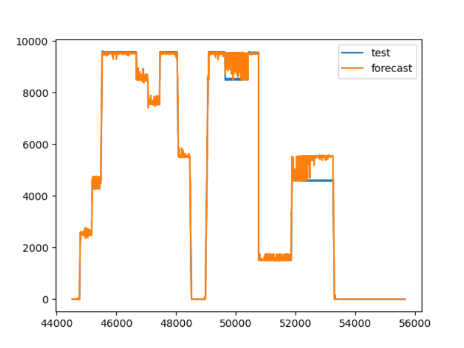

当前最优参数组合：

```python
{'n_estimators': 200}
```

待优化的参数组合：

```python
param_grid = {
        'n_estimators': [200],
        'max_depth': [3, 4, 5, 6, 7],
        # 'min_samples_split': [2, 3, 4, 5, 6],
        # 'min_samples_leaf': [1, 2, 3, 4, 5],
        # 'max_features': ['sqrt', 'log2']
    }
```

运行结果：

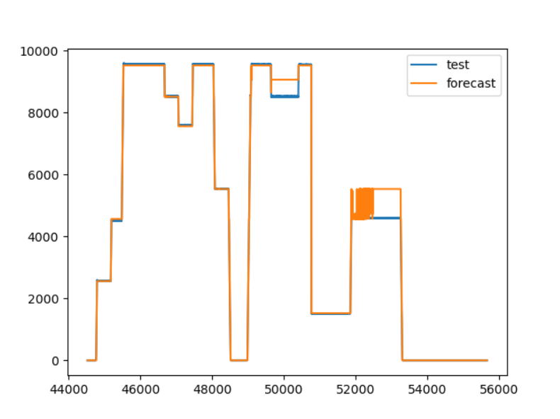

当前最优参数组合：

```python
{'n_estimators': 200, 'max_depth': 4}
```

待优化的参数组合：

```python
param_grid = {
        'n_estimators': [200],
        'max_depth': [4],
        'min_samples_split': [2, 3, 4, 5, 6],
        # 'min_samples_leaf': [1, 2, 3, 4, 5],
        # 'max_features': ['sqrt', 'log2']
    }
```

运行结果：

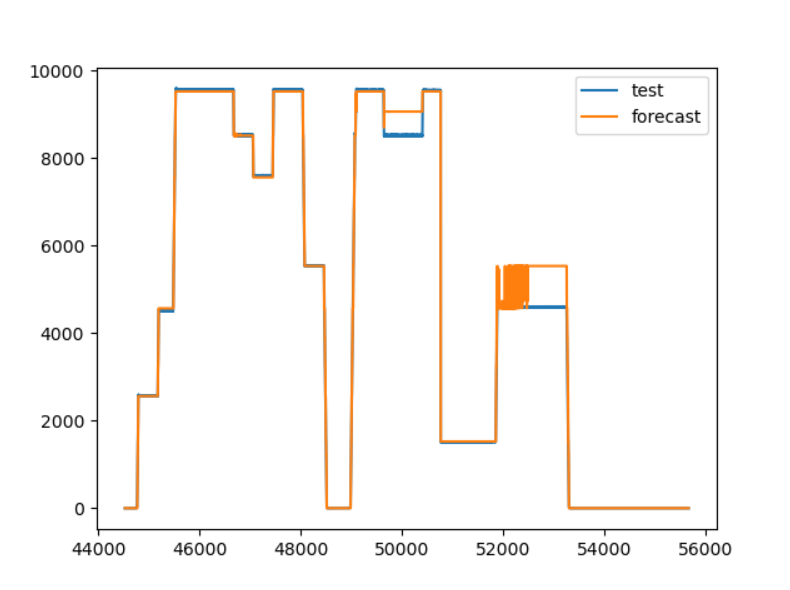

当前最优参数组合：

```python
{'n_estimators': 200, 'max_depth': 4, 'min_samples_split': 6}
```

待优化的参数组合：

```python
param_grid = {
        'n_estimators': [200],
        'max_depth': [4],
        'min_samples_split': [6],
        'min_samples_leaf': [1, 2, 3, 4, 5],
        # 'max_features': ['sqrt', 'log2']
    }
```

运行结果：

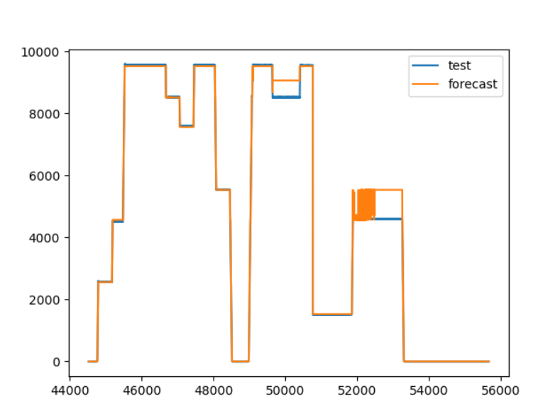

当前最优参数组合：

```python
{'n_estimators': 200, 'max_depth': 4, 'min_samples_split': 6, 'min_samples_leaf': 1}
```

待优化的参数组合：

```python
param_grid = {
        'n_estimators': [200],
        'max_depth': [4],
        'min_samples_split': [6],
        'min_samples_leaf': [1],
        'max_features': ['sqrt', 'log2']
    }
```

运行结果：

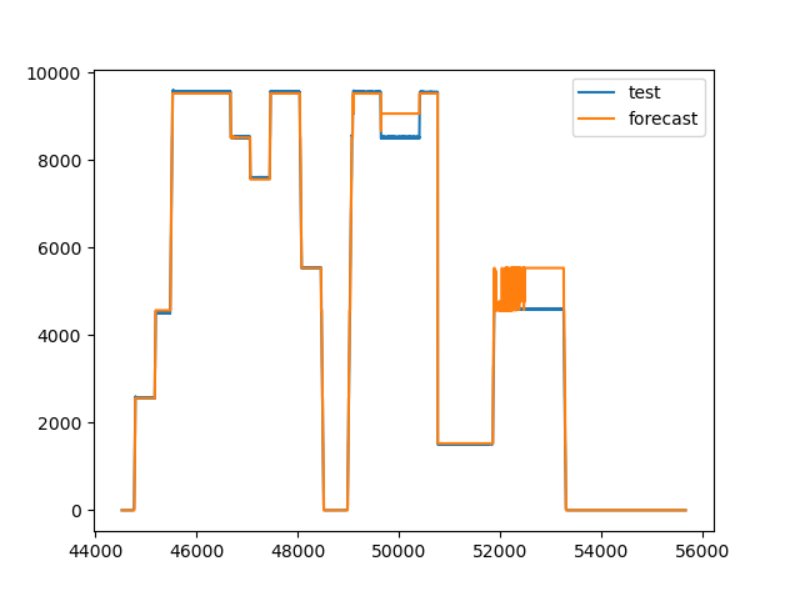

当前最优参数组合：

```python
{'n_estimators': 200, 'max_depth': 4, 'min_samples_split': 6, 'min_samples_leaf': 1, 'max_features': 'sqrt'}
```

通过以上的测试过程，我们逐步得到了当前的最优参数组合：

```python
{'n_estimators': 200, 'max_depth': 4, 'min_samples_split': 6, 'min_samples_leaf': 1, 'max_features': 'sqrt'}
```

最终得到的趋势预测曲线具有较好的预测效果。在大部分数据点上，预测的数据和真实数据都能基本吻合，在部分数据点上，预测数据和真实数据之间存在一定的偏差，但是数据的偏差较小。从整体上来看，预测数据的整体变化趋势和真实情况相符，说明使用randomForest模型对该情景进行时序预测是可行的，后续可通过继续调整参数来优化模型，减小在个别数据点上的偏差。


接下来，我们对所有的参数组合进行一次遍历：

```
param_grid = {
    'n_estimators': [100, 200, 300, 400, 500],
    'max_depth': [3, 4, 5, 6, 7],
    'min_samples_split': [2, 3, 4, 5, 6],
    'min_samples_leaf': [1, 2, 3, 4, 5],
    'max_features': ['sqrt', 'log2']
}
```

此时输出的最优参数组合为：

```
{'n_estimators': 100, 'max_depth': 4, 'min_samples_split': 3, 'min_samples_leaf': 1, 'max_features': 'log2'}
```

结果如下：

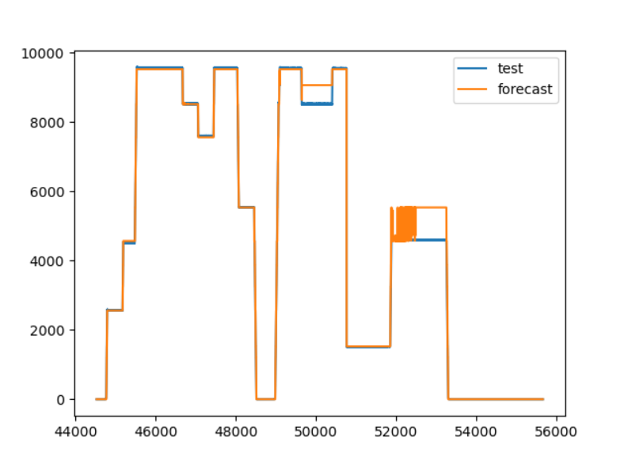

接下来，我们逐步缩小待优化参数的取值范围，来尝试获取到更加准确的参数组合。

待优化参数：

```
param_grid = {
        'n_estimators': [i for i in range(100, 300, 10)], 
        # 'max_depth': [3, 4, 5, 6, 7],
        # 'min_samples_split': [2, 3, 4, 5, 6],
        # 'min_samples_leaf': [1, 2, 3, 4, 5],
        # 'max_features': ['sqrt', 'log2']
    }
```

运行结果：

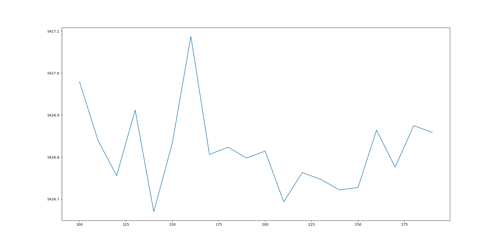

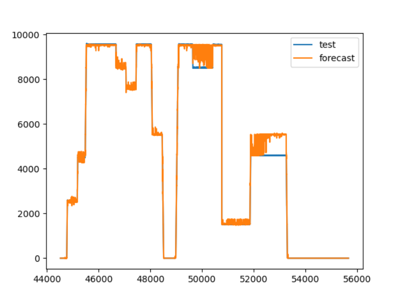

当前最优参数：

```
{'n_estimators': 140}
```

待优化参数：

```
param_grid = {
        'n_estimators': [i for i in range(130, 150)],
        # 'max_depth': [3, 4, 5, 6, 7],
        # 'min_samples_split': [2, 3, 4, 5, 6],
        # 'min_samples_leaf': [1, 2, 3, 4, 5],
        # 'max_features': ['sqrt', 'log2']
    }
```

运行结果：

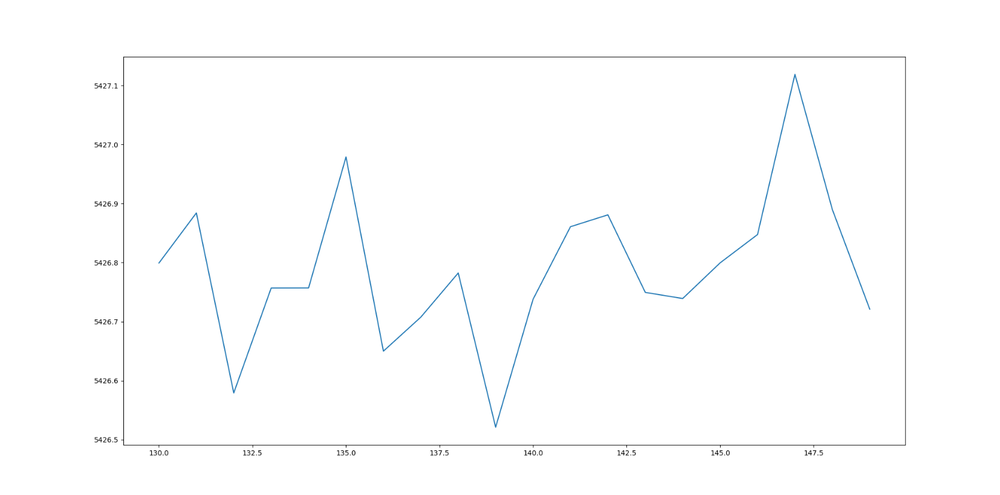


当前最优参数：

```
{'n_estimators': 139}
```

待优化参数：

```
param_grid = {
        'n_estimators': [139],
        'max_depth': [3, 4, 5, 6, 7],
        # 'min_samples_split': [2, 3, 4, 5, 6],
        # 'min_samples_leaf': [1, 2, 3, 4, 5],
        # 'max_features': ['sqrt', 'log2']
    }
```

运行结果：

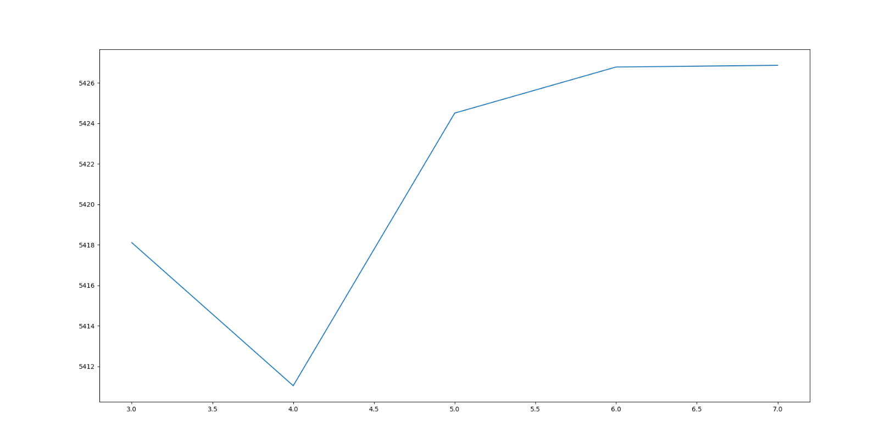


当前最优参数：

```
{'n_estimators': 139, 'max_depth': 4}
```

待优化参数：

```
param_grid = {
        'n_estimators': [139],  # 决策树的个数,从100到300，步长为10
        'max_depth': [4],
        'min_samples_split': [2, 3, 4, 5, 6],
        # 'min_samples_leaf': [1, 2, 3, 4, 5],
        # 'max_features': ['sqrt', 'log2']
    }
```

运行结果：

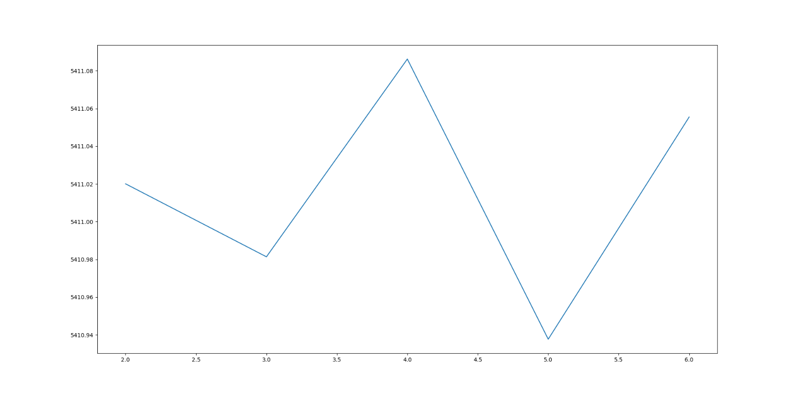

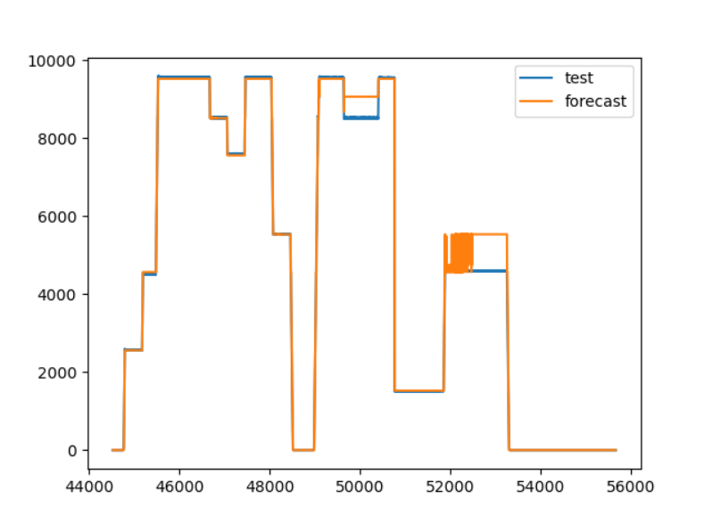

当前最优参数：

```
{'n_estimators': 139, 'max_depth': 4, 'min_samples_split': 5}
```

待优化参数：

```
param_grid = {
        'n_estimators': [139],
        'max_depth': [4],
        'min_samples_split': [5],
        'min_samples_leaf': [1, 2, 3, 4, 5],
        # 'max_features': ['sqrt', 'log2']
    }
```

运行结果：

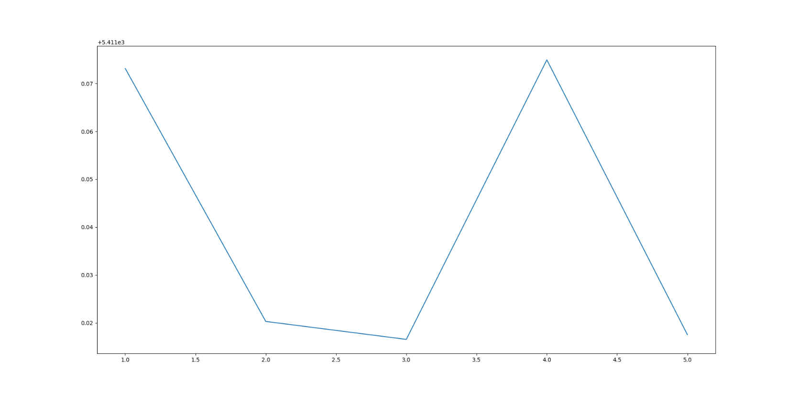


当前最优参数：

```
{'n_estimators': 139, 'max_depth': 4, 'min_samples_split': 5, 'min_samples_leaf': 3}
```

待优化参数：

```
param_grid = {
        'n_estimators': [139],
        'max_depth': [4],
        'min_samples_split': [5],
        'min_samples_leaf': [3],
        'max_features': ['sqrt', 'log2']
    }
```

运行结果：

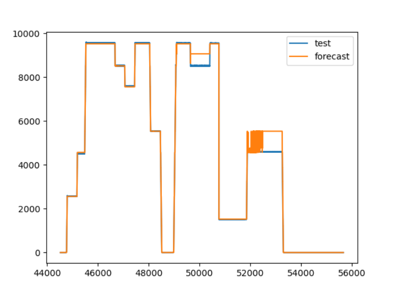

当前最优参数：

```
{'n_estimators': 139, 'max_depth': 4, 'min_samples_split': 5, 'min_samples_leaf': 3, 'max_features': 'sqrt'}
```

我们可以发现，通过遍历所有的参数组合获取到的结果，和我们逐步优化参数获取到的结果是有一定差距的。这种结果说明我们考虑的这几个参数是存在一定的关联的，后续进行的参数调整会受到其他参数的影响。逐步调参只能得到一个相对较好的模型，想要得到更好的模型则需要尝试使用网格调参等方式，遍历可能的参数组合。不过，这种方式是非常耗费时间的，同时，我们最后得到的模型也可能并不能在性能上有巨大的提升，目前正在考虑使用其他可能有较好预测结果的模型。