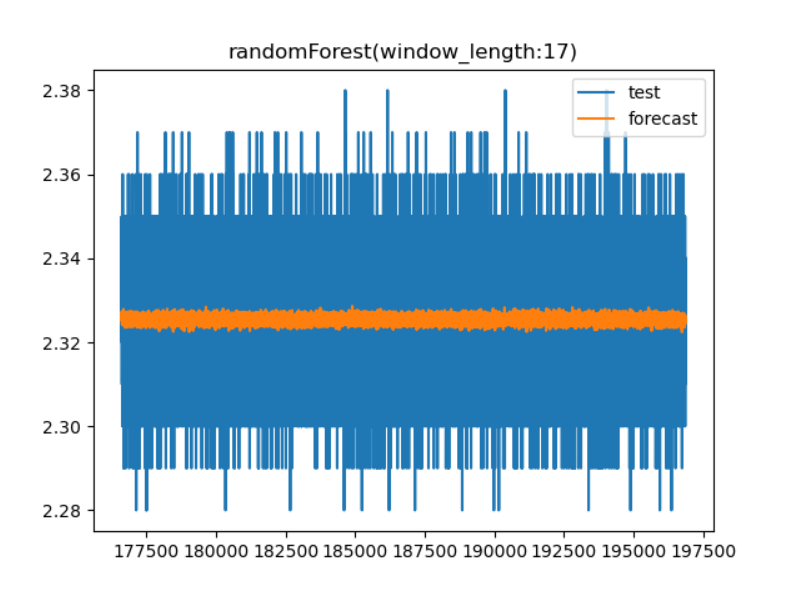

# 趋势预测报告（randomForest模型）

[参考代码链接](**https://github.com/xiao21wei/technology**)

该报告重点关注randomForest模型的参数调优问题，通过使用不同的参数组合来构建模型，比较不同模型下的预测结果，比较结果，得出最优参数。最后我们使用得到的最优参数组合来构建模型，并使用该模型进行趋势预测。

为提升参数调优过程使用的时间，我们使用训练数据集中的最后一个小时的数据用于参数调优时的训练数据集，并把测试数据集的前10分钟的数据作为参数调优时的测试数据集。

```
scorel = []
    for i in range(0, 200, 10):
        model = RandomForestRegressor(n_estimators=i + 1)
        model.fit(x_train, y_train)
        score = model.score(x_test, y_test)
        scorel.append(score)
    print(scorel)
    plt.plot(range(0, 200, 10), scorel)
    plt.show()
    
    best_n = scorel.index(max(scorel)) * 10 + 1
    print(best_n)
```


此时最优参数为151

```
scorel = []
    for i in range(145, 155):
        model = RandomForestRegressor(n_estimators=i)
        model.fit(x_train, y_train)
        score = model.score(x_test, y_test)
        scorel.append(score)
    print(scorel)
    plt.plot(range(145, 155), scorel)
    plt.show()

    best_n = scorel.index(max(scorel)) + 145
    print(best_n)
```


此时最优参数为153

```
param_grid = {
        'n_estimators': [500],
        'max_depth': [3],
        'min_samples_split': [2, 3, 4, 5, 6]
    }
```

此时最优参数为4

```
param_grid = {
        'n_estimators': [500],
        'max_depth': [3],
        'min_samples_split': [4],
        'min_samples_leaf': [1, 2, 3, 4, 5]
    }
```

此时最优参数为2

```
param_grid = {
        'n_estimators': [500],
        'max_depth': [3],
        'min_samples_split': [4],
        'min_samples_leaf': [1],
        'max_features': ['auto', 'sqrt', 'log2']
    }
```

此时最优参数为log2

使用随机搜索，来获取到最优的参数组合

```
# 随机森林自动调参
    param_grid = {
        'n_estimators': [153],
        'min_samples_split': np.arange(2, 22, 1),
        'min_samples_leaf': np.arange(1, 11, 1),
        'max_features': ['sqrt', 'log2']
    }
    model = RandomForestRegressor()
    rf_random = RandomizedSearchCV(estimator=model, param_distributions=param_grid, n_iter=100, cv=3, verbose=2, random_state=42, n_jobs=-1)
    rf_random.fit(x_train, y_train)
    print(rf_random.best_params_)
```


此时最优参数组合为：

```
{'n_estimators': 153, 'min_samples_split': 18, 'min_samples_leaf': 9, 'max_features': 'log2'}
```

使用网格搜索来获取最优参数组合

```
# 随机森林自动调参
    param_grid = {
        'n_estimators': [153],
        'min_samples_split': np.arange(2, 22, 1),
        'min_samples_leaf': np.arange(1, 11, 1),
        'max_features': ['sqrt', 'log2']
    }
    model = RandomForestRegressor()
    rf_grid = GridSearchCV(estimator=model, param_grid=param_grid, cv=10)
    rf_grid.fit(x_train, y_train)
    print(rf_grid.best_params_)
```


此时最优参数组合为：

```
{'max_features': 'sqrt', 'min_samples_leaf': 10, 'min_samples_split': 16, 'n_estimators': 153}
```

网格搜索是一种穷举搜索方法，它通过遍历超参数的所有可能组合来寻找最优超参数。网格搜索首先为每个超参数设定一组候选值，然后生成这些候选值的笛卡尔积，形成超参数的组合网格。接着，网格搜索会对每个超参数组合进行模型训练和评估，从而找到性能最佳的超参数组合。

随机搜索是一种随机化的搜索方法，它通过随机采样超参数的组合来寻找最优超参数。与网格搜索相比，随机搜索不会遍历所有可能的超参数组合，而是在超参数空间中随机抽取一定数量的组合进行评估。

所以，随机搜索时可能会忽略网格搜索中出现的最优参数组合，也有可能不会比较这个最优参数组合。所以，网格搜索得到的参数组合，更加符合该组数据的预测需求，在后续的预测过程中将使用网格搜索得到的最优参数组合。

接下来我们考虑特征窗口长度对模型的影响

```
scorel = []
    for n in range(1, 30):
        data = df.copy()

        for i in range(1, n + 1):
            data['ypre_' + str(i)] = data['y'].shift(i)
        data = data[['ds'] + ['ypre_' + str(i) for i in range(n, 0, -1)] + ['y']]  # 选择特征

        x_train = data[(data['ds'] < mid_time) & (data['ds'] > start_time)].dropna()[['ypre_' + str(i) for i in range(n, 0, -1)]]
        y_train = data[(data['ds'] < mid_time) & (data['ds'] > start_time)].dropna()['y']
        x_test = data[(data['ds'] >= mid_time) & (data['ds'] < end_time)].dropna()[['ypre_' + str(i) for i in range(n, 0, -1)]]
        y_test = data[(data['ds'] >= mid_time) & (data['ds'] < end_time)].dropna()['y']

        model = RandomForestRegressor(n_estimators=153, min_samples_split=16, min_samples_leaf=10, max_features='sqrt')
        # 训练模型
        model.fit(x_train, y_train)
        # 预测
        forecast = model.predict(x_test)
        score = model.score(x_test, y_test)
        scorel.append(score)
    # 输出最大值对应的索引
    print(scorel.index(max(scorel)) + 1)
    plt.plot(range(1, 30), scorel)
    plt.show()
```


通过对特征窗口长度对该模型的结果的比较，得出如上的图像，由此可知，当特征提取窗口长度取17时，得到的结果和实际情况最为符合，所以，在后续的测试过程中我们将把17作为特征提取窗口长度。


接下来我们把数据集扩大到整个数据集

**数据参数**

| 参数             | 值                    |
| ---------------- | --------------------- |
| 开始时间         | 2023-04-26 16: 04: 14 |
| 分隔时间         | 2023-05-03 16: 04: 14 |
| 结束时间         | 2023-05-04 16: 04: 14 |
| 训练数据集数据量 | 133436                |
| 测试数据集数据量 | 20254                 |



我们尝试每10个数据取一个进行训练和测试

此时用于训练和测试的数据量分别为13344和2026


我们尝试每100个数据取一个进行训练和测试

此时用于训练和测试的数据量分别为1335和203


我们尝试每300个数据取一个进行训练和测试

此时用于训练和测试的数据量分别为445和68


我们尝试每500个数据取一个进行训练和测试

此时用于训练和测试的数据量分别为267和41


我们尝试每1000个数据取一个进行训练和测试

此时用于训练和测试的数据量分别为134和21


我们发现在数据量较大时的预测效果较好。

随机森林模型，相较于prophet模型，在预测的结果上有了明显的提升，可以观察到，即使在未对数据进行处理时，随机森林模型也有较好的表现，预测得到的趋势可以在一定程度当展现出数据的变化趋势，并且准确性较高。随着数据间隔逐渐增大，数据之间的关联性减小，该模型预测得到的趋势曲线的变化趋势开始和真实数据有了较大的差距，这是正常现象，后续的模型研究中需要重点关注对训练数据的调整。