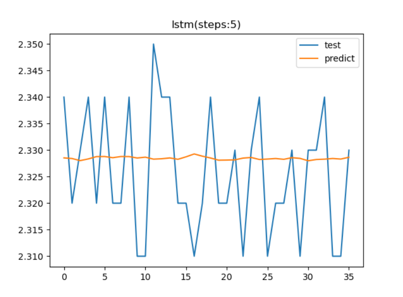
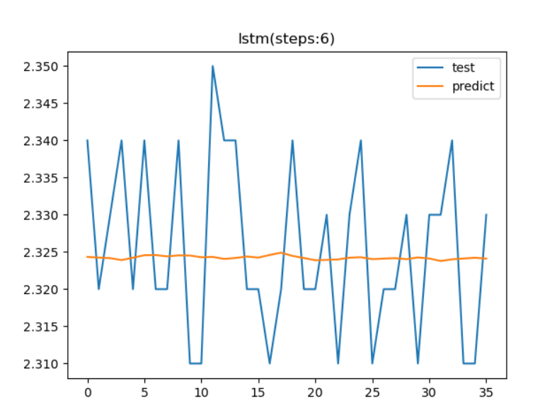
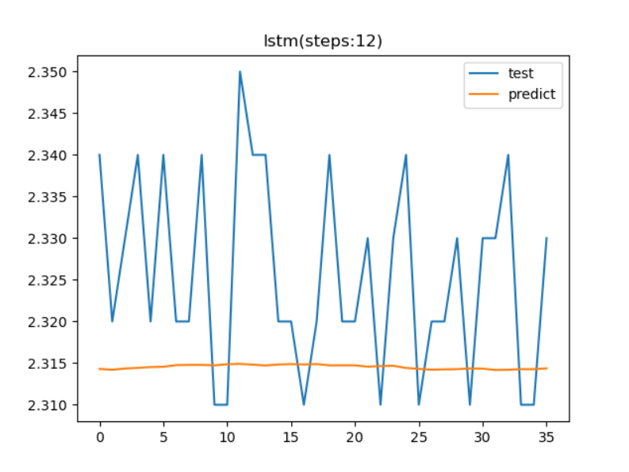
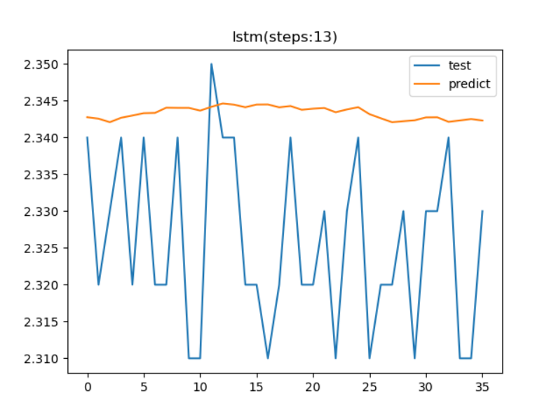
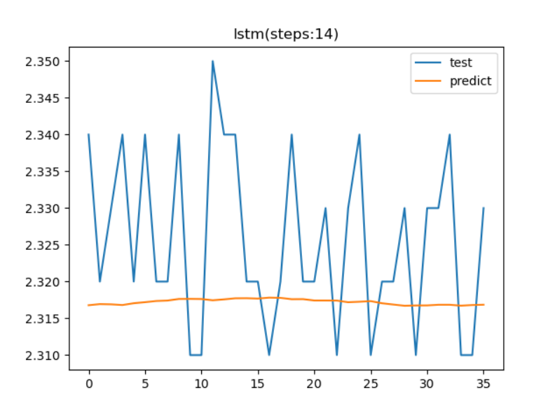
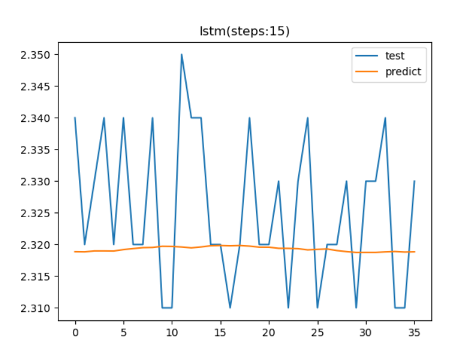
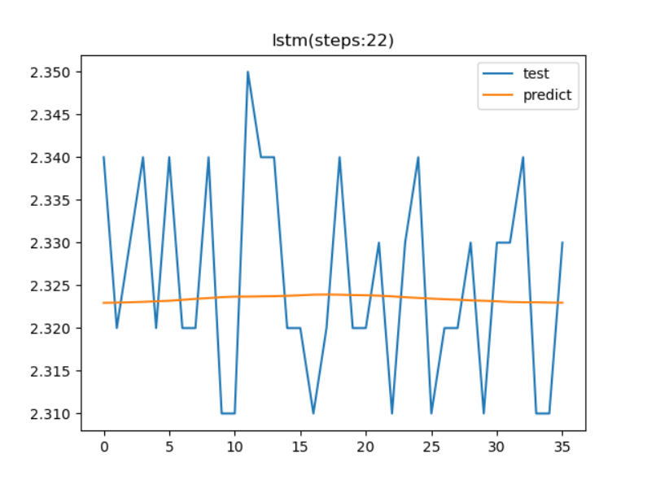
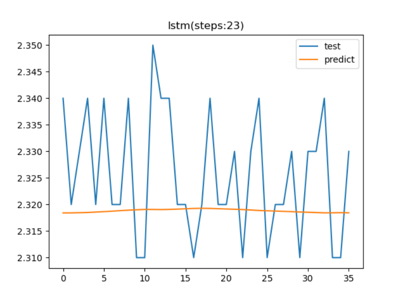
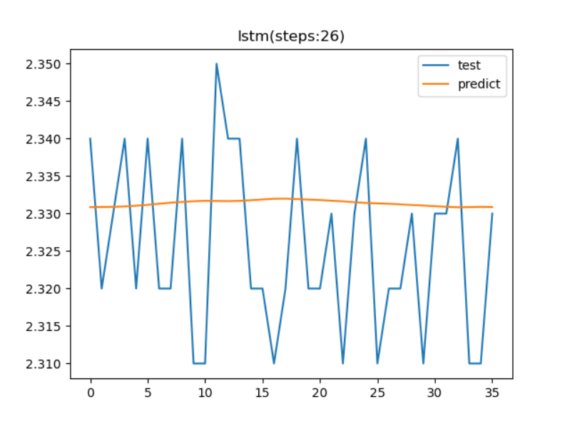
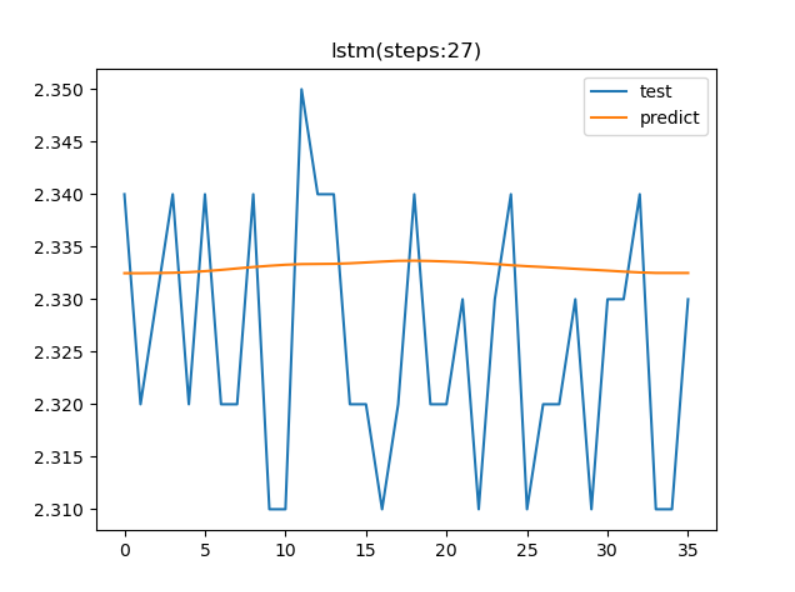

# 趋势预测报告

[参考代码链接](https://github.com/xiao21wei/technology)

## 数据集获取

本次趋势预测适用的数据集是`P2072B`设备上的`cs4`测点的加速度低频数据。我们获取到的数据总共有308条数据，我们将前272条数据作为训练数据集，将后36条数据作为测试数据集。

```python
def load_three_data(start, end):
    data = get_history("b1161555a5cf4cb0f060a7442127b7b6", "cs4", start, end)
    if data is not None and len(data["trendInfo"]) != 0:
        trendInfo = data["trendInfo"]
        f = open("1Aa.csv", "w", encoding="utf-8", newline="")
        csv_writer = csv.writer(f)
        csv_writer.writerow(["trendTime", "three"])
        for trend in trendInfo:
            trendTime = trend["trendTime"]
            t = time.strftime("%Y-%m-%d %H:%M:%S", time.localtime(trendTime / 1000))
            three = trend["trendValue"][0]["three"]
            csv_writer.writerow([t, three])
        f.close()

```

该数据集的数据有一定的变化，存在一定的规律性，但是规律性不是很强，并且存在一定数量的异常值。使用该数据集能够较好地比较统计学模型，机器学习模型和循环神经网络的预测性能进行比较。该数据集划分训练集和测试集后，结果如下：


## 统计学模型

首先使用统计学模型进行趋势预测。统计学模型选用的是Facebook推出的Prophet模型。该模型在传统的趋势、周期性成分的基础上，进一步细化考虑了时序拐点等因素。根据下图中我们得到的预测数据，可以观察到该模型在预测趋势时，自动舍弃了极端异常值，即偏离数据集中区域较大的值。最终得到预测数据的不确定区间，以及预测得到的数据变化趋势。


我们将预测得到的数据和真实数据绘制到一张图中，进行比较分析，可以发现预测趋势有一定的变化，但是这种变化，并不能准备却表现出数据的真实情况，预测值和真实值之间存在较大的差距，在预测数据中，数据存在先上升后下降再上升的变化趋势，而真实数据则是在这段时间内，数据出现多次的升降变化，预测得到的趋势变化曲线只能反应出一个非常粗略的变化趋势，并不能反应真实情况。


该模型的趋势预测结果较差，这是因为该数据集在数据变化上的规律性不强。从数据整体上我们能够观察到数据的大致变化趋势，但是，这细微的变化，不足以用来做出准确的趋势预测，最终结果也表明，统计学模型只能在有限的时间范围内预测数据的变化趋势。

## 机器学习模型

使用机器学习实现时序预测时，通常需要通过滑动窗口的方式来提取特征和标签，而后在实现预测时实际上也需滑动的截取测试集特征实现单步预测。所以用于提取特征的滑动窗口的长度会极大地影响到趋势预测的性能。我们一次使用3~29作为特征提取窗口的长度，一次使用机器学习模型进行趋势预测，然后记录得到的数据，并进行比较分析。

特征提取窗口长度：3


特征提取窗口长度：4


特征提取窗口长度：5


特征提取窗口长度：6


特征提取窗口长度：7


特征提取窗口长度：8


特征提取窗口长度：9


特征提取窗口长度：10


特征提取窗口长度：11


特征提取窗口长度：12


特征提取窗口长度：13


特征提取窗口长度：14


特征提取窗口长度：15


特征提取窗口长度：16


特征提取窗口长度：17


特征提取窗口长度：18


特征提取窗口长度：19


特征提取窗口长度：20


特征提取窗口长度：21


特征提取窗口长度：22


特征提取窗口长度：23


特征提取窗口长度：24


特征提取窗口长度：25


特征提取窗口长度：26


特征提取窗口长度：27


特征提取窗口长度：28


特征提取窗口长度：29


通过比较分析上述的特征提取窗口长度可以发现，不同的特征提取窗口长度预测得到的趋势变化曲线有较大差距，个人认为当特征提取窗口长度为13和25时得到的趋势变化曲线能够较好的反映出数据变化趋势。这可能时是由数据变化的周期性引起的变化。在其他的特征提取窗口长度下，只有个别的时间点能够反映出真实的数据，并且对于绝大多数情况，在趋势预测的前半部分都有较好的表现，但是在趋势预测的后半部分的趋势预测得到的数据与真实值差距较大，并且在趋势变化上表现也较差，这主要是由于，将前半部分得到的可能存在误差的数据作为趋势预测的数据输入导致的。但是，总体来看，机器学习模型在统计学模型的基础上能够对规律性较弱的时间序列进行预测，这是因为，机器学习的数据预测受最近的数据影响较大，在规律性不强时，还模型可以通过最近的数据，分析提取出数据的特征，并利用这些特征来对接下来的数据进行趋势预测。

## 循环神经网络


时间步长：3


时间步长：4


时间步长：5



时间步长：6



时间步长：7


时间步长：8


时间步长：9


时间步长：10


时间步长：11


时间步长：12



时间步长：13



时间步长：14



时间步长：15



时间步长：16


时间步长：17


时间步长：18


时间步长：19


时间步长：20


时间步长：21


时间步长：22



时间步长：23



时间步长：24


时间步长：25


时间步长：26



时间步长：27



时间步长：28


时间步长：29

